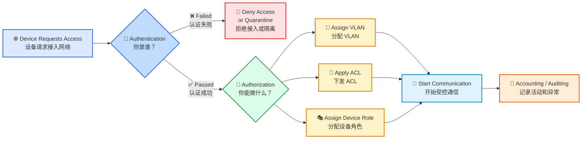

# 🌐 第 1 课：认证、授权与审计

> 🎯 本节目标：
> 搞清楚网络接入控制中最基础、最重要的三个概念： <span style="color:#2563eb;font-weight:bold;">认证 Authentication</span>、 <span style="color:#16a34a;font-weight:bold;">授权 Authorization</span>、 <span style="color:#ea580c;font-weight:bold;">审计 / 计费 Accounting / Auditing</span>。

---

## 1. 🧭 设备接入网络时，网络需要解决什么问题？

一台设备插上网线或者连接 Wi-Fi，并不代表它天然可信。

网络通常需要依次回答三个问题：

| 图标 | 概念                                                           | 英文                    | 核心问题   |
| -- | ------------------------------------------------------------ | --------------------- | ------ |
| 🪪 | <span style="color:#2563eb;font-weight:bold;">认证</span>      | Authentication        | 你是谁？   |
| 🔐 | <span style="color:#16a34a;font-weight:bold;">授权</span>      | Authorization         | 你能做什么？ |
| 📝 | <span style="color:#ea580c;font-weight:bold;">审计 / 计费</span> | Accounting / Auditing | 你做过什么？ |

这三者经常合称为：

## ⭐ AAA

```text
Authentication  →  Authorization  →  Accounting
认证身份          →  分配权限          →  记录行为
```

> ✅ 最简单的记忆方式：
> **先证明身份，再获得权限，最后留下记录。**

---

## 2. 🪪 认证 Authentication：确认“你是谁”

### 2.1 什么是认证？

<span style="color:#2563eb;font-weight:bold;">认证</span>的作用是确认用户或设备声明的身份是否真实。

例如，一台工业网关告诉网络：

```text
我是 Industrial-Gateway-023。
```

这只是设备在**声明身份**。

网络还需要进一步问：

```text
你如何证明？
```

设备可能通过以下方式证明身份：

| 图标  | 认证方式       | 简单说明           |
| --- | ---------- | -------------- |
| 👤  | 用户名和密码     | 常见于登录、VPN、管理后台 |
| 📜  | 数字证书和私钥    | 适合设备身份认证，安全性较高 |
| 📶  | SIM / eSIM | 常见于蜂窝通信设备      |
| 🎟️ | Token      | 常见于 API 或平台接入  |
| 🧩  | 安全芯片中的设备密钥 | 用硬件保护设备身份      |
| 🔑  | 预共享密钥 PSK  | 简单，但管理和泄露风险较高  |

---

### 2.2 ⚠️ 一个重要区别：身份标识 ≠ 身份证明

设备发送自己的名称、序列号、IP 地址或者 MAC 地址，并不一定算完成认证。

例如：

```text
MAC 地址可以被修改。
```

攻击者可能把自己的 MAC 地址改成合法设备的 MAC 地址。

因此要记住：

> 🚨 <span style="color:#dc2626;font-weight:bold;">身份标识不等于身份证明。</span>

对于数字通信设备，更值得重点掌握的认证方式是：

* 📜 **设备证书**
* 🔑 **私钥**
* 📶 **SIM / eSIM 身份**
* 🛡️ **安全芯片中的硬件身份**

---

## 3. 🔐 授权 Authorization：决定“你能做什么”

### 3.1 什么是授权？

<span style="color:#16a34a;font-weight:bold;">授权</span>发生在认证之后。

认证成功，只表示网络已经确认了设备身份。

它并不代表设备可以访问所有资源。

例如：

| 设备       | 授权结果        |
| -------- | ----------- |
| 📷 摄像头   | 只能访问视频服务器   |
| 🏭 工业网关  | 只能访问生产控制平台  |
| 📱 访客手机  | 只能访问互联网     |
| 💻 研发电脑  | 可以访问代码服务器   |
| 🖥️ 普通终端 | 不能访问交换机管理地址 |

---

### 3.2 用公司门禁来理解

可以这样类比：

| 场景            | 网络中的含义 |
| ------------- | ------ |
| 门卫确认你是张三      | 认证     |
| 系统规定张三只能进入研发楼 | 授权     |

所以：

> ✅ <span style="color:#16a34a;font-weight:bold;">认证成功，不等于拥有全部权限。</span>

---

### 3.3 网络中常见的授权结果

| 图标 | 授权方式      | 作用              |
| -- | --------- | --------------- |
| 🧱 | VLAN 分配   | 把设备放入指定网络区域     |
| 🚦 | ACL       | 限制可访问的 IP、端口和协议 |
| 🎭 | 设备角色 Role | 根据设备类型应用统一策略    |
| 📉 | 带宽限制      | 限制设备通信速率        |
| 🧊 | 隔离策略      | 禁止设备直接访问其他终端    |
| ⏰  | 访问时段      | 只允许在指定时间接入      |

---

## 4. 📝 审计 / 计费 Accounting / Auditing：记录“你做过什么”

### 4.1 什么是审计？

<span style="color:#ea580c;font-weight:bold;">审计</span>用于记录设备接入网络后的活动。

常见记录包括：

* ⏱️ 设备什么时候接入
* 🪪 使用了什么身份
* ✅ 认证是否成功
* 🧱 被分配到哪个 VLAN
* 🌐 获得了哪个 IP 地址
* 🖥️ 访问了哪些服务
* 🔌 什么时候离线
* ⚠️ 发生了什么异常

---

### 4.2 设备侧日志示例

```text
[10:01:05] Ethernet link up
[10:01:06] Starting 802.1X authentication
[10:01:07] EAP-TLS handshake started
[10:01:08] Server certificate verified
[10:01:09] Authentication succeeded
[10:01:10] VLAN assigned: 100
[10:01:12] DHCP address obtained: 10.10.100.23
```

---

### 4.3 为什么设备开发人员要重视审计？

对设备开发来说，日志特别重要。

因为现场可能出现：

| 问题          | 可能原因            |
| ----------- | --------------- |
| ❌ 设备认证失败    | 证书错误、密码错误、服务器拒绝 |
| 🌐 设备拿不到 IP | DHCP 失败、VLAN 错误 |
| ⏱️ TLS 握手失败 | 设备时间错误、证书过期     |
| 🚫 业务访问失败   | ACL 限制、授权策略不允许  |
| 🔁 接入反复中断   | 链路抖动、认证超时       |

没有清晰的日志，就很难判断问题发生在哪一步。

> 🧠 工程重点：
> **设备日志不是“锦上添花”，而是现场排障的重要依据。**

---

## 5. 🔄 AAA 完整流程图



这个流程可以概括为：

1. 🌐 设备请求接入网络。
2. 🪪 网络要求设备证明身份。
3. ❌ 认证失败，拒绝接入或进入隔离网络。
4. ✅ 认证成功，根据身份分配权限。
5. 🔐 设备只能在授权范围内通信。
6. 📝 系统记录设备的接入过程和行为。

---

## 6. 🏭 工业网关接入示例

假设一台工业网关通过网线连接交换机。

---

### 6.1 第一步：认证

网关使用设备证书证明身份。

网络检查：

* 📜 证书是否由可信 CA 签发
* ⏳ 证书是否过期
* 🚫 证书是否被吊销
* 🔑 网关是否持有对应私钥

验证成功后，网络确认：

```text
该设备是合法的 Industrial-Gateway-023。
```

---

### 6.2 第二步：授权

认证服务器下发策略：

```text
Device Role: Industrial-Gateway
VLAN: 200
Allowed: 10.20.0.10 TCP 8883
Denied: Office Network and Management Network
```

这表示：

| 策略             | 含义             |
| -------------- | -------------- |
| 🎭 Device Role | 这是一台工业网关       |
| 🧱 VLAN 200    | 放入工业设备网络区域     |
| ✅ Allowed      | 允许访问指定 MQTT 服务 |
| 🚫 Denied      | 禁止访问办公网和管理网    |

也就是说：

> 这台网关虽然是合法设备，但它仍然只能访问自己该访问的服务。

---

### 6.3 第三步：审计

系统记录：

```text
Device: Industrial-Gateway-023
Authentication: EAP-TLS
Result: Success
Switch Port: GigabitEthernet 1/0/8
Assigned VLAN: 200
IP Address: 10.20.200.23
```

这些信息可以帮助工程师以后排查：

* 设备是否成功认证
* 设备接入了哪个交换机端口
* 网络给它分配了哪个 VLAN
* 它最终拿到了哪个 IP 地址

---

## 7. ⚠️ 初学者容易混淆的地方

### 7.1 登录成功不等于拥有全部权限

登录成功属于：

> 🪪 <span style="color:#2563eb;font-weight:bold;">认证</span>

能否访问某个页面或服务器属于：

> 🔐 <span style="color:#16a34a;font-weight:bold;">授权</span>

---

### 7.2 IP 地址不是可靠身份

IP 地址可能变化、复用，甚至被伪造。

所以不能仅根据 IP 地址判断设备身份。

> 🚨 IP 地址更像“当前位置”，不是可靠的“身份证”。

---

### 7.3 MAC 地址不是强身份凭据

MAC 地址容易修改，更适合作为辅助信息或低安全场景的兼容方案。

> ⚠️ MAC 地址可以辅助识别设备，但不适合高安全等级的强身份认证。

---

### 7.4 加密不等于认证

加密解决的是：

```text
别人能不能看懂通信内容？
```

认证解决的是：

```text
通信对象到底是谁？
```

TLS 可以同时提供加密和身份认证，但两者是不同概念。

| 概念    | 解决的问题    |
| ----- | -------- |
| 🔒 加密 | 防止别人看懂内容 |
| 🪪 认证 | 确认对方真实身份 |

---

### 7.5 审计日志不能泄露敏感信息

日志中可以记录证书编号和错误原因，但不应记录：

* ❌ 私钥
* ❌ 明文密码
* ❌ 完整 Token
* ❌ 预共享密钥
* ❌ 可以直接用于冒充设备的敏感材料

> ✅ 好日志应该帮助排障。
> ❌ 坏日志可能变成安全漏洞。

---

## 8. 🛠️ 面向设备开发需要关注什么？

---

### 8.1 身份方面

开发设备时，需要思考：

* 🪪 每台设备是否有唯一身份？
* ⚠️ 是否所有设备共用相同密码或私钥？
* 💾 私钥是否保存在普通 Flash 中？
* 🛡️ 是否使用安全芯片保护密钥？

---

### 8.2 授权方面

需要明确设备到底应该访问什么：

* 🎯 设备真正需要访问哪些服务器？
* 🔐 是否遵循最小权限原则？
* 🚫 设备是否可以访问无关网段？
* 🔁 策略发生变化后如何重新授权？

---

### 8.3 审计方面

设备日志至少应该帮助判断：

* ❌ 能否区分认证拒绝和网络超时？
* ⏳ 能否定位证书过期或时间错误？
* 🔄 是否记录了完整的认证状态变化？
* 🕒 日志时间是否准确？
* 🧨 日志是否泄露密钥或密码？

---

## 9. 🧠 本节记忆口诀

```text
认证：确认你是谁
授权：决定你能做什么
审计：记录你做过什么
```

对应英文：

```text
Authentication → Identity
Authorization  → Permission
Accounting     → Record
```

也可以记成：

| 步骤  | 关键词        | 解释     |
| --- | ---------- | ------ |
| 1️⃣ | Identity   | 先确认身份  |
| 2️⃣ | Permission | 再分配权限  |
| 3️⃣ | Record     | 最后记录行为 |

---

## 10. 📝 自测题

### 题目 1

一台设备使用正确密码登录成功，但无法访问管理页面。

答案：

* 密码验证属于：🪪 **认证**
* 是否可以访问管理页面属于：🔐 **授权**

---

### 题目 2

交换机记录某设备在 14:20 接入 VLAN 30，并于 15:10 离线。

答案：

* 属于：📝 **审计 / Accounting**

---

### 题目 3

网络只根据 MAC 地址判断设备是否合法，有什么风险？

答案：

* MAC 地址容易被伪造
* 它不适合作为高安全等级的强身份凭据

---

## 11. ✅ 本节总结

网络接入控制中的三个基础问题是：

| 图标 | 概念                                                      | 作用        |
| -- | ------------------------------------------------------- | --------- |
| 🪪 | <span style="color:#2563eb;font-weight:bold;">认证</span> | 确认设备身份    |
| 🔐 | <span style="color:#16a34a;font-weight:bold;">授权</span> | 根据身份分配权限  |
| 📝 | <span style="color:#ea580c;font-weight:bold;">审计</span> | 记录接入过程和行为 |

设备开发不能只考虑：

```text
设备能不能联网
```

还需要考虑：

* 🪪 接入设备是否可信
* 🔐 设备获得了什么权限
* 🔑 私钥和证书是否安全
* 🧯 认证失败能否快速定位
* 📝 网络行为是否可以追踪

---

## 🌟 一句话总结

> <span style="color:#7c3aed;font-weight:bold;">网络接入安全不是简单地“连上网”，而是要确认：谁连上了、能访问什么、做过什么。</span>

---

## 📌 下一节预告

下一讲进入：

# 第 2 课：NAC 是什么，为什么需要控制入网？

下一讲会重点解释：

* 为什么设备不能一插网线就完全放行
* NAC 在网络里到底扮演什么角色
* 认证失败、隔离网络、访客网络是什么
* NAC 和数字通信设备开发有什么关系
