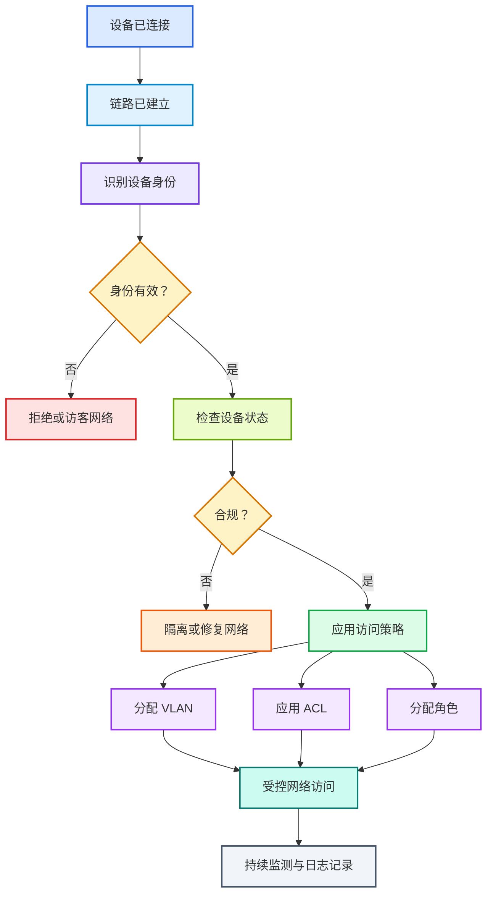
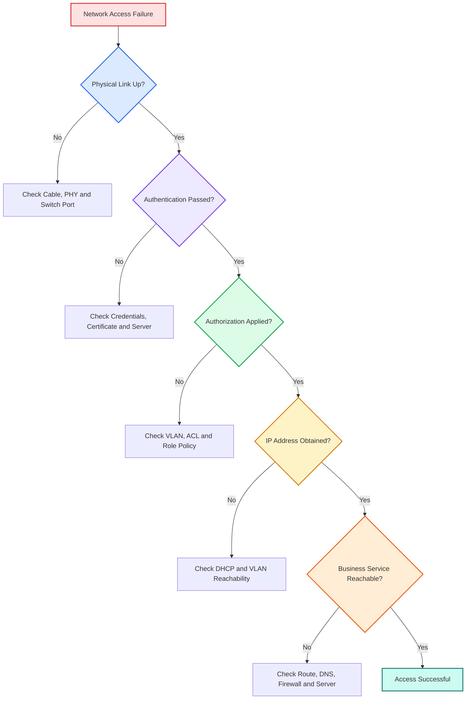

# 🌐 第 2 课：NAC 是什么，为什么要控制设备入网？

> 🎯 **本节目标**
> 从最基础的“设备插上网线之后发生了什么”开始，理解：
>
> * 什么是网络接入
> * 什么是 NAC
> * 为什么不能让设备一接上线就完全放行
> * NAC 会检查哪些信息
> * 认证失败、隔离网络、访客网络分别是什么
> * NAC 与数字通信设备开发有什么关系

---

## 1. 🧭 先理解：什么叫“接入网络”？

很多初学者会认为：

```text
网线插上了 = 已经进入网络
```

实际上，这两个概念并不完全相同。

### 1.1 🔌 物理连接成功

当设备插上网线，网卡和交换机端口完成协商后，通常会出现：

```text
Link Up
```

这表示：

* 网线和接口基本正常
* 双方已经建立物理链路
* 网卡可以开始收发以太网帧

但它只说明：

> 🔌 **物理连接已经建立。**

它并不一定说明设备已经获得业务网络访问权限。

---

### 1.2 🌐 获得网络访问权限

设备真正访问网络，通常还需要经过多个步骤：

1. 物理链路建立
2. 接入身份检查
3. 网络策略授权
4. VLAN 或访问策略生效
5. 获取 IP 地址
6. 访问业务服务器

因此要特别记住：

> 🚨 <span style="color:#dc2626;font-weight:bold;">Link Up 不等于已经获得业务网络权限。</span>

---

## 2. 🛡️ 什么是 NAC？

**NAC** 的全称是：

```text
Network Access Control
```

中文通常称为：

> <span style="color:#2563eb;font-weight:bold;">网络接入控制</span>

它的核心作用是：

> 在设备正式进入业务网络之前，先识别设备、检查设备、判断策略，再决定允许它访问什么。

可以把 NAC 理解成网络入口处的：

# 🚪 智能门禁系统

---

## 3. 🏢 用公司大楼门禁理解 NAC

假设一个人准备进入公司大楼。

门禁系统可能依次做这些事情：

| 门禁动作          | 网络中的对应概念 |
| ------------- | -------- |
| 🪪 检查工牌       | 身份认证     |
| 👤 查询员工部门     | 身份与角色识别  |
| 🚦 判断能否进入     | 接入决策     |
| 🏢 只能进入指定楼层   | 授权       |
| 🧊 工牌异常时进入接待区 | 隔离或访客网络  |
| 📝 记录进出时间     | 审计       |

所以，NAC 并不只是“检查密码”。

它更像一个完整的决策系统：

```text
识别设备 → 验证身份 → 检查状态 → 匹配策略 → 控制权限 → 记录结果
```

---

## 4. ❓ 为什么设备不能一接上线就完全放行？

如果网络对所有接入设备都直接放行，会出现很多风险。

---

### 4.1 👾 未知设备可能进入内部网络

例如：

* 外来笔记本
* 被攻击者控制的设备
* 未登记的测试设备
* 仿冒合法设备的终端
* 员工私自接入的小路由器

如果这些设备可以直接访问内部网，攻击者就可能获得进一步攻击的入口。

> 🚨 <span style="color:#dc2626;font-weight:bold;">网络入口一旦失去控制，内部网络就不再天然安全。</span>

---

### 4.2 🦠 合法设备也可能处于不安全状态

即使设备身份是真的，也不代表它当前一定安全。

例如：

* 固件版本过旧
* 系统存在高危漏洞
* 安全配置被关闭
* 证书已经过期
* 设备被恶意软件控制
* 调试接口处于开放状态

因此：

> ✅ <span style="color:#16a34a;font-weight:bold;">身份可信</span>
> 不一定等于
> ✅ <span style="color:#16a34a;font-weight:bold;">设备状态安全</span>

---

### 4.3 🔐 不同设备不应该拥有相同权限

例如：

| 设备类型    | 合理权限        |
| ------- | ----------- |
| 📷 摄像头  | 访问视频平台      |
| 🏭 工业网关 | 访问生产控制服务器   |
| 💻 研发电脑 | 访问代码仓库和测试环境 |
| 📱 访客手机 | 只能访问互联网     |
| 🧰 运维终端 | 访问部分管理系统    |

如果所有设备接入后都进入同一个网络，权限就会过大。

这违反了一个非常重要的安全原则：

> 🔐 <span style="color:#7c3aed;font-weight:bold;">最小权限原则：设备只获得完成工作所必需的权限。</span>

---

## 5. 🧠 NAC 到底会判断哪些信息？

现代 NAC 往往不是只检查单一信息，而是进行综合判断。

---

### 5.1 🪪 设备是谁？

NAC 可能检查：

* 用户名
* 设备证书
* SIM / eSIM 身份
* MAC 地址
* 设备序列号
* 企业资产编号
* 设备账户

其中，证书和硬件密钥通常比 MAC 地址更可靠。

> ⚠️ MAC 地址可以帮助识别设备，但它容易被修改，不能单独作为高安全等级的身份证明。

---

### 5.2 🧩 设备是什么类型？

NAC 可能识别设备是：

* 办公电脑
* IP 电话
* 摄像头
* 打印机
* 工业控制器
* 通信网关
* 测试仪器
* 访客终端

这种识别通常称为：

```text
Device Profiling
```

也就是：

> 根据设备表现出来的特征，判断它大概属于什么设备类型。

例如，系统可能通过以下信息辅助判断：

* MAC 地址厂商信息
* DHCP 请求特征
* 操作系统特征
* 开放的网络服务
* 设备证书内容
* 历史通信行为

---

### 5.3 🩺 设备是否符合安全要求？

这类检查常被称为：

```text
Posture Assessment
```

可以通俗地理解为：

> 检查设备当前的“健康状态”或“合规状态”。

例如检查：

* 固件版本是否符合要求
* 是否启用了必要的安全功能
* 是否安装指定补丁
* 防病毒软件是否正常
* 设备证书是否有效
* 配置是否符合公司的安全基线

#### 什么是安全基线？

安全基线就是一组最低安全要求。

例如：

```text
固件版本不得低于 3.2.0
必须关闭默认管理员密码
必须启用安全启动
设备证书必须处于有效期内
调试接口必须关闭
```

设备不满足这些要求，就可能被视为“不合规设备”。

---

### 5.4 🚦 设备应该获得什么权限？

NAC 最终会根据策略决定：

* 是否允许接入
* 分配到哪个 VLAN
* 应用哪组 ACL
* 是否限制带宽
* 是否进入隔离区
* 是否只能访问修复服务器
* 是否只能访问互联网

所以 NAC 的结果通常不是简单的一句：

```text
允许或拒绝
```

它还可能决定：

```text
允许接入，但只能访问指定资源。
```

---

## 6. 🚦 NAC 常见的接入结果

### 6.1 ✅ 正常放行

设备身份可信，状态也符合要求。

可能获得：

* 正式业务 VLAN
* 正常访问权限
* 对应设备角色
* 指定 ACL
* 合理的网络带宽

例如：

```text
Role: Industrial-Gateway
VLAN: 200
Access Policy: Production-MQTT-Only
```

---

### 6.2 🚫 拒绝接入

设备身份无效或风险过高。

常见原因包括：

* 证书伪造
* 认证信息错误
* 设备被列入黑名单
* 多次异常认证
* 设备身份已被撤销
* 策略明确禁止该设备接入

此时交换机或 AP 不允许设备进入业务网络。

---

### 6.3 🧊 隔离网络

设备没有被完全拒绝，但也不能进入正式业务网络。

这种网络通常称为：

```text
Quarantine Network
```

也就是：

> 隔离网络。

隔离网络中的设备通常只能访问：

* 认证服务器
* 修复服务器
* 升级服务器
* 补丁服务器
* 设备管理平台
* 少量必要的基础服务

不能访问：

* 生产业务系统
* 办公网
* 管理网
* 数据库
* 其他终端设备

---

### 6.4 🌍 访客网络

访客设备可能被放入专门的访客区域。

常见策略是：

* 允许访问互联网
* 禁止访问内部网络
* 限制带宽
* 限制接入时间
* 记录访客身份
* 禁止访客设备互相访问

访客网络的重点是：

> 🌐 可以提供基本网络服务，但不能让访客进入内部业务网络。

---

### 6.5 🛠️ 修复网络

某些设备身份合法，但安全状态不合规。

例如：

```text
设备身份合法
固件版本过旧
```

网络可以只允许它访问升级服务器。

设备完成升级后，再次进行状态检查和接入认证。

这个过程可以表示为：

```text
发现不合规
    ↓
进入修复网络
    ↓
升级或修改配置
    ↓
重新检查
    ↓
进入正式业务网络
```

---

## 7. 🔄 NAC 入网决策流程



这个流程可以理解为：

1. 设备建立物理连接
2. 网络识别设备
3. 验证设备身份
4. 检查设备是否符合安全要求
5. 根据策略决定权限
6. 分配 VLAN、ACL 或角色
7. 设备开始受控通信
8. 系统继续记录和监测

---

## 8. 🧩 NAC 系统里常见的组成部分

一个 NAC 方案通常涉及多个设备或系统。

---

### 8.1 📱 终端设备

也就是想接入网络的一方。

例如：

* 电脑
* 手机
* 摄像头
* 工业网关
* 通信终端
* 嵌入式设备

终端设备需要提供身份信息，或者响应网络发起的认证请求。

---

### 8.2 🚪 交换机或无线 AP

交换机和无线 AP 位于网络入口。

它们主要负责：

* 暂时限制设备通信
* 转发认证信息
* 根据 NAC 决策开放端口
* 分配 VLAN
* 下发 ACL
* 执行隔离策略

可以把交换机或 AP 理解为：

> 🚪 网络入口处真正执行开门、关门和分流的设备。

---

### 8.3 🧠 认证与策略服务器

认证与策略服务器负责判断：

* 设备身份是否可信
* 设备属于什么角色
* 设备是否符合安全要求
* 应该允许什么权限
* 失败后应该拒绝还是隔离

完成判断之后，它会把结果返回给交换机或 AP。

---

### 8.4 🗃️ 身份与资产系统

NAC 可能还会查询：

* 用户目录
* 设备资产数据库
* 证书系统
* 黑名单
* 安全管理平台
* 设备管理平台
* 固件版本数据库

这说明 NAC 通常不是一台独立设备完成所有事情，而是多个系统共同协作。

---

## 9. 🔗 NAC 与 AAA 的关系

上一课学习了：

* 🪪 认证 Authentication
* 🔐 授权 Authorization
* 📝 审计 Accounting / Auditing

NAC 可以看作 AAA 在网络接入场景中的具体应用。

| AAA 阶段 | NAC 中的实际动作     |
| ------ | -------------- |
| 🪪 认证  | 验证用户或设备身份      |
| 🔐 授权  | 分配 VLAN、ACL、角色 |
| 📝 审计  | 记录接入时间、结果和行为   |

因此：

> <span style="color:#2563eb;font-weight:bold;">NAC 不是一个单独的认证协议，而是一套网络接入管理机制。</span>

---

## 10. 🔐 NAC 与 802.1X 的关系

初学者经常把 NAC 和 802.1X 混为一谈。

它们并不是同一个概念。

### NAC

NAC 是一套完整的接入控制思想和系统。

它负责：

* 谁可以接入
* 接入后可以做什么
* 不合规时如何处理
* 如何记录和持续监测

### 802.1X

802.1X 是一种常见的接入认证框架。

它主要帮助 NAC 完成：

> 设备接入网络时的身份认证和端口控制。

可以这样理解：

```text
NAC = 整套门禁管理系统

802.1X = 门口常用的一种身份核验和开门机制
```

> 💡 NAC 的范围更大，802.1X 是 NAC 可以采用的一种重要技术手段。

---

## 11. 🏭 工业网关接入 NAC 的例子

假设一台工业网关接入生产网络。

---

### 11.1 第一步：物理链路建立

设备日志显示：

```text
Ethernet Link Up
```

这时网线和端口正常，但设备还没有正式业务权限。

---

### 11.2 第二步：进行设备身份认证

网关使用设备证书证明身份。

NAC 判断：

```text
Device: Industrial-Gateway-023
Certificate: Valid
Asset Status: Registered
```

这表示：

* 证书有效
* 设备已经登记
* 设备身份可信

---

### 11.3 第三步：检查设备状态

NAC 或设备管理平台检查：

```text
Firmware Version: 3.2.1
Security Baseline: Passed
Certificate Status: Valid
```

设备当前固件和配置符合安全要求。

---

### 11.4 第四步：分配访问权限

策略服务器返回：

```text
Role: Industrial-Gateway
VLAN: 200
Allowed Service: 10.20.0.10 TCP 8883
Denied Network: Office and Management Network
```

这表示设备：

* 被放入 VLAN 200
* 只能访问指定 MQTT Broker
* 不能访问办公网
* 不能访问管理网

---

### 11.5 第五步：设备开始通信

设备进入 VLAN 200，获得 IP 地址，并访问指定的 MQTT Broker。

这时：

* ✅ 设备已接入
* ✅ 身份已验证
* ✅ 权限已限制
* ✅ 行为可以审计

---

## 12. ⚠️ 初学者容易混淆的地方

### 12.1 Link Up 不等于认证成功

```text
Link Up
```

只表示物理链路已经建立。

设备可能仍然处于：

* 未认证状态
* 正在认证状态
* 隔离状态
* 访客状态
* 等待策略状态

---

### 12.2 获取到 IP 不一定表示拥有完整权限

有些隔离网络也会提供 DHCP 服务。

因此设备拿到 IP 地址后，仍然可能只能访问少数服务器。

> 🌐 IP 地址表示设备具备一定的网络通信条件，但不能单独证明它拥有完整业务权限。

---

### 12.3 认证失败不一定是密码错误

认证失败还可能由以下原因造成：

* 证书过期
* 设备时间错误
* 认证服务器不可达
* 交换机配置错误
* 设备没有启动认证程序
* TLS 握手失败
* 设备不在资产系统中
* 证书链不受信任

---

### 12.4 NAC 不是防火墙的简单替代品

防火墙主要控制不同网络之间的流量。

NAC 更关注：

* 谁正在接入
* 接入设备是什么
* 是否允许它进入网络
* 应该给它什么接入权限

二者通常需要配合使用。

| 系统        | 主要关注的问题    |
| --------- | ---------- |
| 🛡️ NAC   | 谁可以进入网络    |
| 🧱 防火墙    | 网络流量可以去哪里  |
| 🔍 入侵检测系统 | 流量是否具有攻击特征 |
| 📝 日志系统   | 发生了什么事情    |

---

### 12.5 只依赖 MAC 地址识别风险较高

MAC 地址容易修改。

所以安全要求较高的场景通常更倾向于：

* 设备证书
* 硬件密钥
* 802.1X
* 多种设备特征联合识别
* 资产系统联合判断

---

## 13. 🛠️ 面向数字通信设备开发，需要关注什么？

### 13.1 设备是否支持接入认证？

需要明确设备是否支持：

* 802.1X
* EAP-TLS
* 设备证书认证
* SIM / eSIM 认证
* 必要的认证重试机制

---

### 13.2 认证前允许哪些通信？

设备在认证成功前，网络可能只允许极少数报文。

开发时需要理解：

* 哪些认证报文可以发送
* DHCP 是认证前还是认证后进行
* NTP 是否可用
* DNS 是否可用
* 证书更新服务器是否可访问
* 设备管理平台是否可访问

这点非常重要。

例如，设备验证证书时可能需要正确时间，但设备又需要通过网络访问 NTP 服务器获取时间。

因此系统设计时必须明确：

> 在正式认证之前，设备如何获得必要的时间信息？

---

### 13.3 设备状态机是否清晰？

建议设备软件区分这些状态：

```text
LINK_DOWN
LINK_UP
AUTHENTICATING
AUTHENTICATED
AUTHORIZED
IP_CONFIGURING
ONLINE
QUARANTINED
AUTH_FAILED
```

含义如下：

| 状态               | 含义         |
| ---------------- | ---------- |
| `LINK_DOWN`      | 物理链路未建立    |
| `LINK_UP`        | 物理链路已建立    |
| `AUTHENTICATING` | 正在进行身份认证   |
| `AUTHENTICATED`  | 身份验证成功     |
| `AUTHORIZED`     | 网络权限已经下发   |
| `IP_CONFIGURING` | 正在配置或获取 IP |
| `ONLINE`         | 已进入正常业务状态  |
| `QUARANTINED`    | 被放入隔离网络    |
| `AUTH_FAILED`    | 身份认证失败     |

这样设计的好处是：

* 日志更清楚
* 更容易定位故障
* 上层业务可以判断当前网络状态
* 可以针对不同状态采用不同恢复措施

---

### 13.4 认证失败后如何处理？

设备应考虑：

* 重试间隔
* 最大重试次数
* 链路抖动处理
* 证书过期提示
* 服务器不可达处理
* 是否进入降级模式
* 是否允许本地维护
* 是否需要触发告警

不要出现持续快速重试的情况，例如：

```text
认证失败
立即重试
再次失败
立即重试
……
```

这可能造成：

* 网络负载增加
* 认证服务器压力增大
* 日志快速增长
* 设备功耗增加

更合理的做法通常是使用逐渐增加的重试间隔。

---

### 13.5 日志应该记录什么？

建议至少记录：

* 物理链路状态
* 认证开始时间
* 使用的认证方式
* 当前认证阶段
* 认证失败原因
* 授权结果
* VLAN 或角色变化
* DHCP 结果
* 最终在线状态

但日志不能记录：

* 私钥
* 明文密码
* 完整 Token
* 预共享密钥
* 可以直接冒充设备的敏感数据

---

## 14. 🧯 一个实用的排障思路

当设备“连不上网络”时，不要只看最终结果。

可以按照不同阶段逐步检查：



排查顺序可以概括为：

```text
物理链路
    ↓
身份认证
    ↓
网络授权
    ↓
IP 配置
    ↓
路由与防火墙
    ↓
业务服务
```

这个思路非常重要：

> 🚨 不要把“不能访问业务服务器”全部归因于网络不通。

故障可能发生在：

* 物理层
* 认证阶段
* 授权阶段
* IP 配置阶段
* 路由或防火墙阶段
* 应用服务阶段

---

## 15. 🧠 本节记忆口诀

```text
先识别
再认证
后授权
不合规就隔离
全过程要记录
```

还可以记成：

```text
NAC = Who + What + Health + Policy + Record
```

| 关键词    | 含义        |
| ------ | --------- |
| Who    | 设备是谁      |
| What   | 设备是什么类型   |
| Health | 设备状态是否合规  |
| Policy | 应该获得什么权限  |
| Record | 接入过程是否可追踪 |

---

## 16. 📝 自测题

### 题目 1

设备网口显示 `Link Up`，是否说明已经可以访问业务服务器？

**答案：**

不一定。

`Link Up` 只表示物理链路建立。设备可能仍未完成认证、授权、IP 配置或业务访问策略下发。

---

### 题目 2

设备身份合法，但固件版本过旧，NAC 可以怎么处理？

**答案：**

可以把设备放入隔离网络或修复网络，只允许它访问升级服务器。

设备完成升级后，再重新进行合规检查和授权。

---

### 题目 3

访客手机和工业网关都认证成功，它们应该获得相同权限吗？

**答案：**

不应该。

NAC 应根据设备身份、设备类型和角色，为它们分配不同的 VLAN、ACL 和访问权限。

---

### 题目 4

设备已经获取到 IP 地址，为什么仍然可能无法访问内部服务器？

**答案：**

可能原因包括：

* 设备位于访客 VLAN
* ACL 禁止访问
* 防火墙策略阻止
* NAC 只允许访问修复服务器
* 路由配置异常
* DNS 解析失败
* 业务服务器自身不可用

---

### 题目 5

为什么说 NAC 不仅仅是身份认证？

**答案：**

因为 NAC 除了验证身份，还会：

* 识别设备类型
* 检查设备状态
* 判断设备是否合规
* 分配 VLAN、ACL 和角色
* 隔离异常设备
* 记录接入行为

---

## 17. ✅ 本节总结

NAC 的核心不是简单地“让设备上网”，而是：

| 图标 | 核心任务 | 说明              |
| -- | ---- | --------------- |
| 🔍 | 识别   | 判断设备是谁、是什么      |
| 🪪 | 认证   | 验证设备身份          |
| 🩺 | 检查   | 判断设备状态是否合规      |
| 🔐 | 授权   | 分配 VLAN、ACL 和角色 |
| 🧊 | 隔离   | 限制异常或不合规设备      |
| 📝 | 审计   | 记录接入过程和行为       |

---

## 🌟 一句话总结

> <span style="color:#7c3aed;font-weight:bold;">NAC 就是网络入口处的智能门禁：不是设备插上网线就放行，而是先确认它是谁、状态是否安全，再决定它能访问什么。</span>

---

## 📌 下一课预告

# 第 3 课：802.1X 的三个关键角色

下一课会重点讲解：

* 什么是 802.1X
* Supplicant 是什么
* Authenticator 是什么
* Authentication Server 是什么
* 交换机为什么不直接验证设备证书
* 设备、交换机和 RADIUS 之间如何传递认证消息
* 认证前端口为什么只能通过少量报文
* 设备开发时如何判断 802.1X 卡在了哪个阶段
