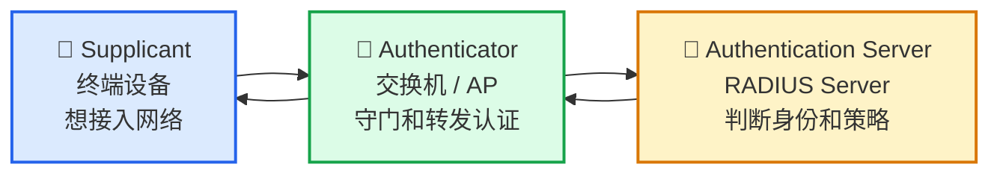
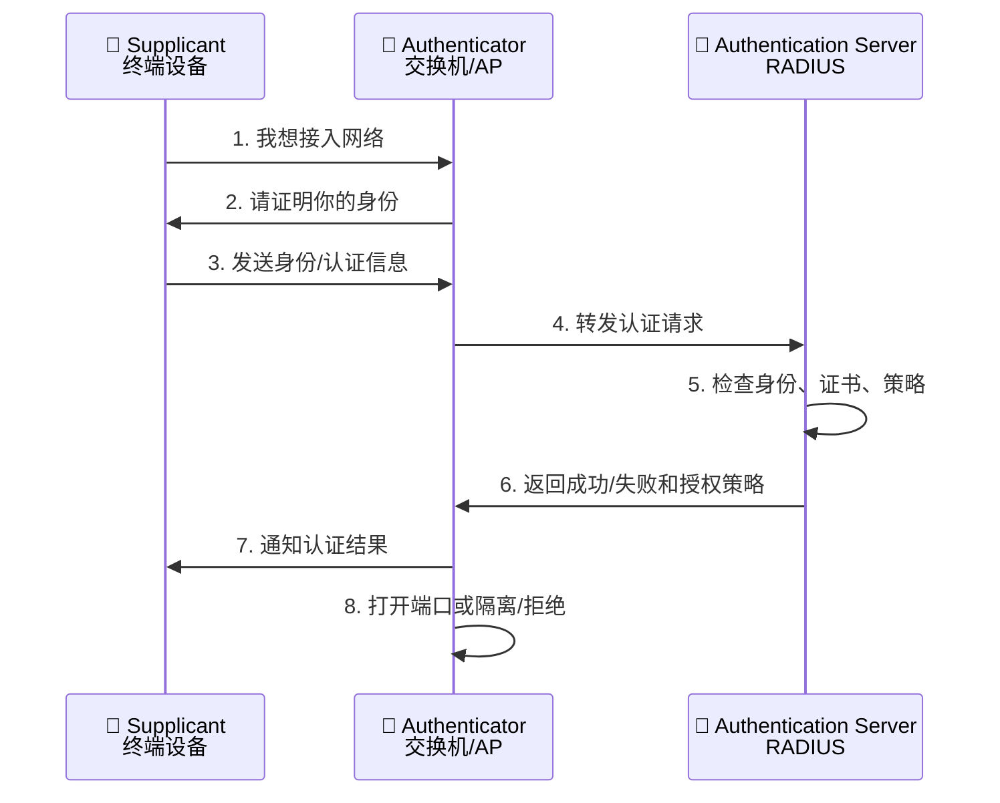
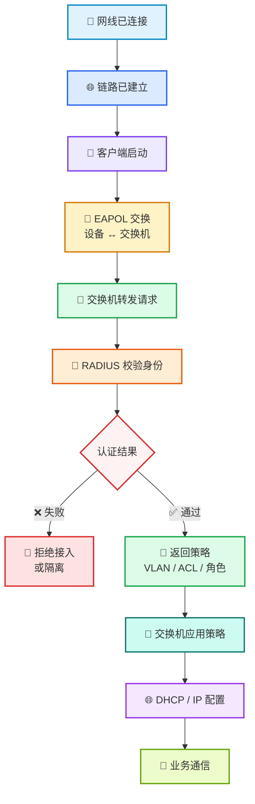
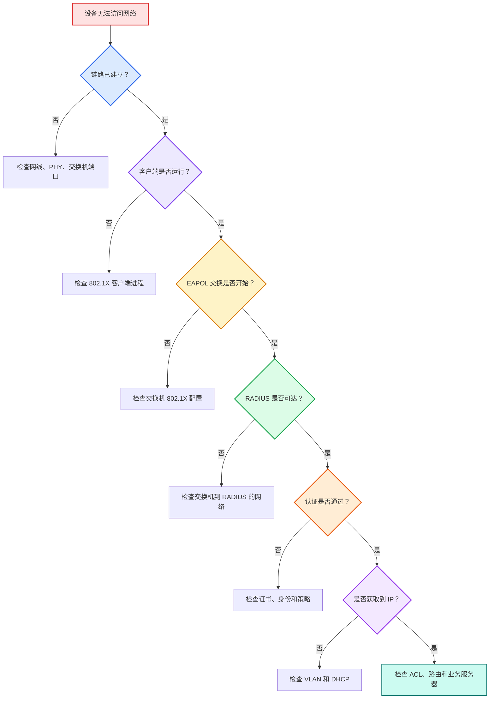

# 🌐 第 3 课：802.1X 的三个关键角色

> 🎯 **本节目标**
> 本课不追求协议细节，而是先把 802.1X 的整体概念和三个关键角色讲清楚。
>
> 学完这一课，你应该能理解：
>
> * 802.1X 是什么
> * 为什么它常用于 NAC
> * Supplicant 是什么
> * Authenticator 是什么
> * Authentication Server 是什么
> * 设备、交换机/AP、RADIUS 服务器之间如何配合
> * 为什么认证前设备不能正常访问业务网络
> * 设备开发时应该关注哪些状态和日志

---

## 1. 🧭 先回顾：NAC 和 802.1X 的关系

上一课我们讲过：

> **NAC 是网络入口处的智能门禁系统。**

它负责判断：

```text
谁可以接入网络？
接入后能访问什么？
异常设备应该隔离还是拒绝？
整个过程是否可记录？
```

而 **802.1X** 是 NAC 中非常常用的一种接入认证机制。

| 概念        | 简单理解             |
| --------- | ---------------- |
| 🛡️ NAC   | 整套网络接入控制系统       |
| 🔐 802.1X | 常用的入网身份认证和端口控制机制 |

可以这样理解：

```text
NAC = 整个公司门禁管理制度
802.1X = 门口刷工牌、核验身份、决定是否开门的一套流程
```

> ✅ <span style="color:#16a34a;font-weight:bold;">802.1X 不是 NAC 的全部，但它是实现 NAC 的重要方式之一。</span>

---

## 2. 🔐 什么是 802.1X？

802.1X 是一种网络接入认证框架。

它常用于：

* 🧱 企业有线网络
* 📶 企业 Wi-Fi
* 🏭 工业网络
* 📡 通信设备接入网络
* 🧪 实验室测试网络
* 🛠️ 运维管理网络

它的核心作用是：

> <span style="color:#2563eb;font-weight:bold;">设备在正式访问网络之前，必须先完成身份认证。</span>

也就是说，一台设备插上网线后，交换机不会立刻让它访问业务网络，而是先问：

```text
你是谁？
你能证明吗？
认证服务器是否认可你？
```

只有认证通过之后，交换机才会根据策略放行。

---

## 3. 🔌 端口不是一开始就完全开放

在普通理解里，交换机端口好像只有两种状态：

```text
插上线 = 能通信
拔掉线 = 不能通信
```

但在 802.1X 场景下，端口状态更接近这样：

```text
物理链路已连接
    ↓
端口处于受控状态
    ↓
只允许认证相关报文通过
    ↓
认证成功后
    ↓
开放业务通信权限
```

所以一定要记住：

> 🚨 <span style="color:#dc2626;font-weight:bold;">Link Up 不等于认证成功，也不等于可以访问业务网络。</span>

---

## 4. 🧩 802.1X 的三个关键角色

802.1X 中最重要的是三个角色：

| 图标 | 角色    | 英文                    | 常见实体          |
| -- | ----- | --------------------- | ------------- |
| 📱 | 申请接入者 | Supplicant            | 终端设备、电脑、嵌入式设备 |
| 🚪 | 认证执行者 | Authenticator         | 交换机、无线 AP     |
| 🧠 | 认证服务器 | Authentication Server | RADIUS 服务器    |

可以先用一句话记住：

> **终端想进网，交换机守门，认证服务器做最终判断。**

---

## 5. 📱 Supplicant：想接入网络的设备

Supplicant 是想要接入网络的一方。

在实际环境里，它可能是：

* 💻 笔记本电脑
* 📱 手机
* 🏭 工业网关
* 📷 摄像头
* 📡 通信终端
* 🧰 测试设备
* 🖥️ 嵌入式 Linux 设备

如果你以后做数字通信设备开发，你开发的设备很多时候就是：

> <span style="color:#2563eb;font-weight:bold;">Supplicant，也就是申请接入网络的终端。</span>

Supplicant 的主要任务是：

* 发起或响应 802.1X 认证
* 提供自己的身份信息
* 使用密码、证书或其他凭据证明身份
* 参与 EAP 认证过程
* 等待网络授权结果
* 认证失败时进行重试或进入异常状态

例如，设备可能会向网络证明：

```text
我是 Industrial-Gateway-023。
我持有对应的设备证书和私钥。
```

---

## 6. 🚪 Authenticator：网络入口处的守门人

Authenticator 是网络入口处的“守门人”。

常见实体是：

* 🧱 有线交换机
* 📶 无线 AP

它位于设备和网络之间。设备想进入网络，必须经过它。

Authenticator 的主要任务是：

* 发现有设备接入端口
* 在认证前限制普通业务流量
* 和终端设备交换 802.1X 认证消息
* 把认证信息转发给认证服务器
* 接收认证服务器返回的结果
* 根据结果打开端口、拒绝接入或分配策略

它不是简单的“网线插口”，而是一个执行接入控制的设备。

---

## 7. 🧠 Authentication Server：真正做判断的认证服务器

Authentication Server 是认证服务器。

在 802.1X 网络中，它通常是：

```text
RADIUS Server
```

也就是 RADIUS 服务器。

它负责最终判断：

```text
这个设备身份是否可信？
应该允许接入吗？
接入后应该给什么权限？
```

RADIUS 服务器可能会检查：

* 用户名和密码是否正确
* 设备证书是否可信
* 证书是否过期
* 证书是否被吊销
* 设备是否在资产系统中
* 设备属于什么角色
* 是否允许当前时间接入
* 应该分配哪个 VLAN
* 应该下发哪组 ACL

例如，它可能返回：

```text
Authentication Result: Success
Role: Industrial-Gateway
VLAN: 200
ACL: Allow-MQTT-Only
```

这表示：

* 设备认证成功
* 设备角色是工业网关
* 设备进入 VLAN 200
* 只能访问指定 MQTT 服务

---

## 8. 🔄 三个角色之间的关系图



可以用一句话理解：

```text
终端把身份信息交给交换机
交换机转交给认证服务器
认证服务器判断结果
交换机根据结果控制端口
```

---

## 9. 📨 认证消息大概怎么走？

这里不讲很深的报文格式，只看宏观流程。



这个流程的重点是：

> ✅ 终端设备通常不直接和 RADIUS 服务器完整通信。
> ✅ 交换机/AP 在中间转发认证信息，并执行最终的端口控制。

---

## 10. 🧱 认证前，设备能发什么？

在 802.1X 场景中，认证前端口一般处于受控状态。

它通常只允许少量认证相关报文通过。

最常见的是：

```text
EAPOL
```

EAPOL 全称是：

```text
EAP over LAN
```

也就是：

> 在局域网上传输 EAP 认证消息。

初学阶段你只需要先这样理解：

```text
EAPOL 是终端设备和交换机之间用于 802.1X 认证的本地报文。
```

它主要发生在：

```text
Supplicant ↔ Authenticator
终端设备 ↔ 交换机/AP
```

---

## 11. 🔐 EAP、EAPOL、RADIUS 的关系

这是初学者很容易混的地方，我们用简单表格区分。

| 名称     | 作用          | 主要发生在          |
| ------ | ----------- | -------------- |
| EAP    | 认证框架        | 端到端承载认证方法      |
| EAPOL  | 在局域网中承载 EAP | 终端 ↔ 交换机/AP    |
| RADIUS | 认证服务器协议     | 交换机/AP ↔ 认证服务器 |

可以这样理解：

```text
EAP = 认证内容
EAPOL = 终端到交换机之间的运输方式
RADIUS = 交换机到认证服务器之间的运输方式
```

一个简单类比：

| 网络概念   | 类比               |
| ------ | ---------------- |
| EAP    | 你要提交的身份证明材料      |
| EAPOL  | 你把材料递给门卫的方式      |
| RADIUS | 门卫把材料送到后台系统审核的方式 |

---

## 12. 🏭 工业网关接入 802.1X 的例子

假设一台工业网关通过网线连接交换机。

### 12.1 第一步：网线连接，链路建立

设备日志可能显示：

```text
Ethernet Link Up
```

此时只是物理链路建立，它还没有正式进入业务网络。

### 12.2 第二步：设备启动 Supplicant

设备启动 802.1X 客户端。

```text
Starting 802.1X supplicant
```

### 12.3 第三步：交换机要求设备证明身份

交换机向设备发起认证请求。

设备开始发送认证相关信息。

```text
EAPOL authentication started
```

### 12.4 第四步：认证服务器判断身份

交换机把认证信息转发给 RADIUS 服务器。

RADIUS 服务器检查：

* 设备证书是否可信
* 设备是否登记在资产系统中
* 设备是否允许接入生产网络

### 12.5 第五步：认证通过，交换机放行

RADIUS 返回成功结果和策略。

```text
Result: Access-Accept
VLAN: 200
Role: Industrial-Gateway
ACL: Allow-MQTT-Only
```

交换机根据结果放行端口，并应用 VLAN 和 ACL。

### 12.6 第六步：设备获取 IP 并访问业务服务器

设备进入授权网络后，继续执行：

```text
DHCP request
Obtain IP address
Connect to MQTT Broker
```

最终设备开始正常业务通信。

---

## 13. 📌 一个完整流程图



---

## 14. ⚠️ 初学者容易混淆的地方

### 14.1 交换机不是认证服务器

交换机是 Authenticator，主要负责：

* 守门
* 转发认证消息
* 执行放行、拒绝、VLAN、ACL 等策略

真正判断身份的通常是 RADIUS 服务器。

### 14.2 设备不是直接找 RADIUS 认证

典型 802.1X 场景是：

```text
设备 ↔ 交换机/AP ↔ RADIUS 服务器
```

设备主要和交换机/AP 交换 EAPOL 报文。

交换机/AP 再把认证信息转发给 RADIUS 服务器。

### 14.3 认证成功不等于所有流量都允许

认证成功后，交换机可能还会应用策略：

* 分配指定 VLAN
* 下发 ACL
* 限制访问范围
* 分配设备角色

所以设备可能只能访问少数指定服务器。

### 14.4 认证失败不一定是设备证书错

认证失败可能来自多个位置：

| 位置        | 可能问题                        |
| --------- | --------------------------- |
| 📱 设备侧    | supplicant 未启动、证书路径错误、私钥不可读 |
| 🚪 交换机/AP | 端口未启用 802.1X、RADIUS 地址配置错误  |
| 🧠 RADIUS | 设备未登记、证书不可信、策略拒绝            |
| 🌐 网络链路   | RADIUS 不可达、交换机到服务器网络不通      |
| 🕒 时间问题   | 设备时间错误导致证书校验失败              |

---

## 15. 🛠️ 设备开发中应该关注什么？

### 15.1 设备是否具备 802.1X 客户端能力？

需要确认设备是否支持：

* 有线 802.1X
* EAP-TLS 或其他 EAP 方法
* 证书配置
* 私钥读取
* 认证状态查询
* 认证失败重试

### 15.2 认证状态要清晰

建议设备日志或状态机能区分：

```text
LINK_UP
SUPPLICANT_STARTING
EAPOL_STARTED
AUTHENTICATING
AUTH_SUCCESS
AUTH_FAILED
POLICY_APPLIED
IP_CONFIGURING
ONLINE
```

这样现场排障时就能知道设备卡在哪里。

### 15.3 注意认证与 DHCP 的先后关系

很多 802.1X 场景下，设备需要先认证，再获得正式网络中的 IP。

常见顺序是：

```text
Link Up
    ↓
802.1X Authentication
    ↓
VLAN / Policy Applied
    ↓
DHCP
    ↓
Business Traffic
```

所以如果设备一直拿不到 IP，不一定是 DHCP 服务器问题。

也可能是：

```text
802.1X 认证根本没有成功。
```

---

## 16. 🧯 实用排障流程



排障口诀：

```text
先看链路
再看客户端
再看 EAPOL
再看 RADIUS
再看认证结果
再看 VLAN 和 DHCP
最后看业务访问
```

---

## 17. 🧠 本节记忆口诀

```text
终端想入网
交换机来守门
RADIUS 做判断
通过后再放行
失败就拒绝或隔离
```

三个角色可以这样记：

| 角色                       | 口诀         |
| ------------------------ | ---------- |
| 📱 Supplicant            | 我要接入网络     |
| 🚪 Authenticator         | 我负责守门和转发   |
| 🧠 Authentication Server | 我负责判断身份和策略 |

---

## 18. 📝 自测题

### 题目 1

在 802.1X 中，工业网关属于哪个角色？

**答案：**

工业网关是想接入网络的终端，所以属于：

```text
Supplicant
```

### 题目 2

交换机在 802.1X 中主要做什么？

**答案：**

交换机通常是：

```text
Authenticator
```

它负责控制端口、转发认证消息、接收认证服务器结果，并执行放行、拒绝、VLAN、ACL 等策略。

### 题目 3

RADIUS 服务器在 802.1X 中主要做什么？

**答案：**

RADIUS 服务器通常是认证服务器。

它负责判断身份是否可信、是否允许接入，以及应该下发什么 VLAN、ACL 或角色。

### 题目 4

设备 Link Up 后为什么仍然不能访问业务服务器？

**答案：**

因为 Link Up 只表示物理链路建立。

设备可能还没有完成：

* 802.1X 认证
* 网络授权
* VLAN 分配
* DHCP 获取 IP
* ACL 放行

### 题目 5

设备一直拿不到 IP，一定是 DHCP 服务器故障吗？

**答案：**

不一定。

如果 802.1X 认证没有成功，设备可能根本没有进入正式 VLAN，因此无法访问对应的 DHCP 服务器。

---

## 19. ✅ 本节总结

802.1X 的核心是：

> <span style="color:#2563eb;font-weight:bold;">设备正式进入网络前，必须先完成身份认证。</span>

它有三个关键角色：

| 图标 | 角色                    | 作用                   |
| -- | --------------------- | -------------------- |
| 📱 | Supplicant            | 想接入网络的终端设备           |
| 🚪 | Authenticator         | 交换机/AP，负责守门和转发       |
| 🧠 | Authentication Server | RADIUS 服务器，负责判断身份和策略 |

认证成功后，交换机可能会：

* ✅ 打开端口
* 🧱 分配 VLAN
* 🚦 应用 ACL
* 🎭 分配设备角色
* 📝 记录接入结果

认证失败后，设备可能会：

* 🚫 被拒绝接入
* 🧊 进入隔离网络
* 🌍 进入访客网络
* 🔁 进行重试

---

## 🌟 一句话总结

> <span style="color:#7c3aed;font-weight:bold;">802.1X 就像网络入口的刷卡认证：终端提交身份，交换机负责守门，RADIUS 服务器负责判断，通过后才允许设备进入授权网络。</span>

---

## 📌 下一课预告

# 第 4 课：EAP-TLS 和证书认证

下一课会重点讲解：

* 什么是 EAP
* 什么是 EAP-TLS
* 为什么设备证书比密码更适合通信设备
* 证书和私钥分别是什么
* CA 是什么
* 设备如何用证书证明自己
* 证书过期、吊销、时间错误为什么会导致认证失败
* 设备开发时如何管理证书和密钥
