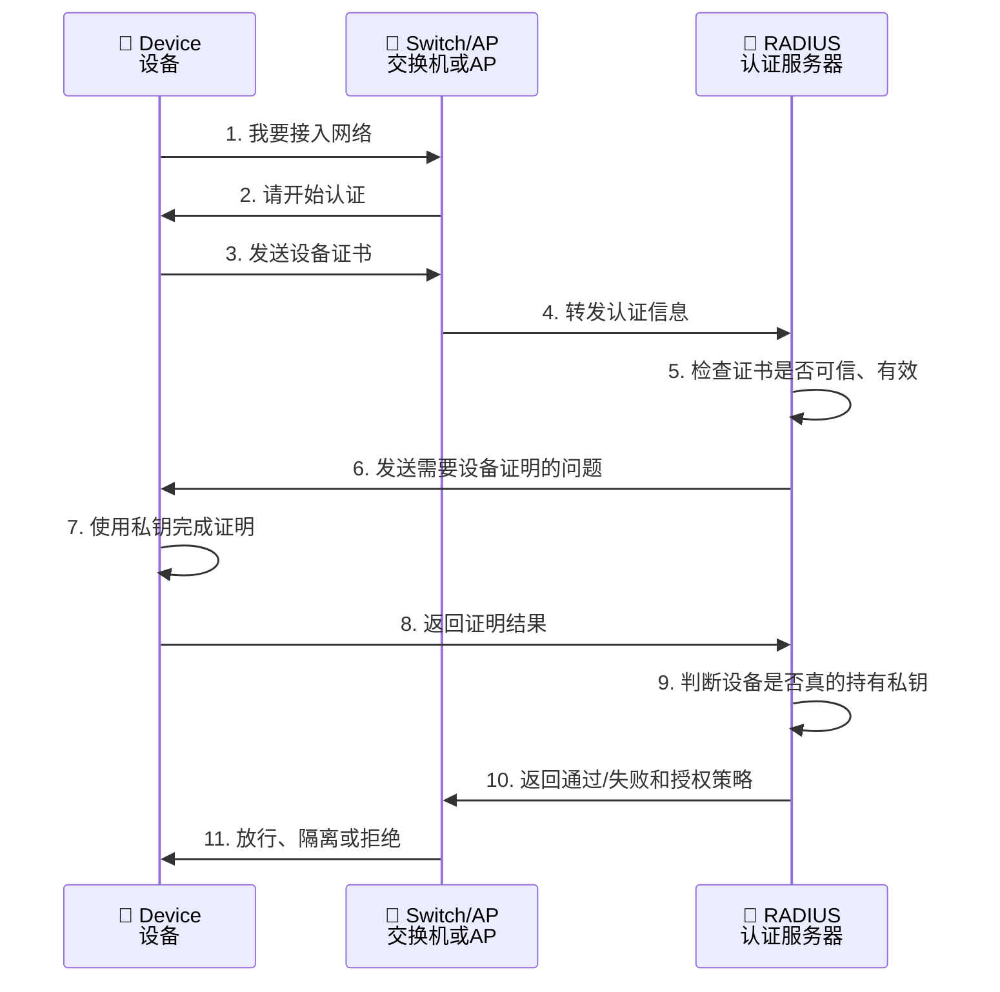
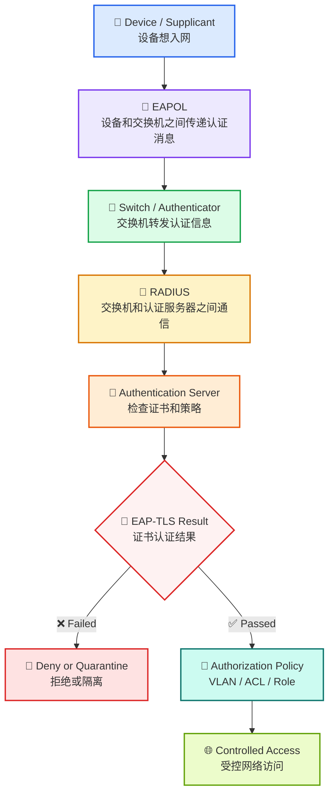
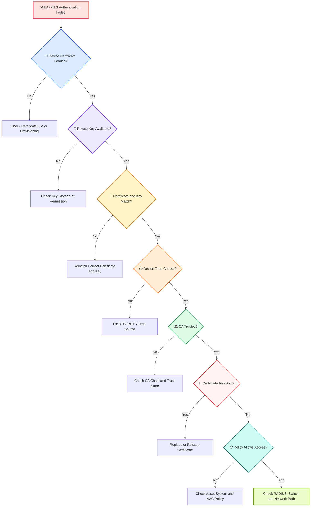

# 🌐 第 4 课：EAP-TLS 和证书认证

> 🎯 **本节目标**
> 本课重点讲清楚 802.1X 中非常常见、也非常适合设备身份认证的一种方式：
>
> # 📜 EAP-TLS
>
> 学完这一课，你应该能理解：
>
> * 什么是 EAP
> * 什么是 EAP-TLS
> * 为什么通信设备常用证书认证
> * 证书、私钥、CA 分别是什么
> * 设备如何用证书证明自己
> * EAP-TLS 在 802.1X 流程中怎么工作
> * 证书过期、时间错误、私钥丢失为什么会导致认证失败
> * 设备开发时应该关注哪些证书和密钥问题

---

## 1. 🧭 先回顾：802.1X 里谁在做什么？

上一课我们讲了 802.1X 的三个角色：

| 图标 | 角色         | 英文                    | 简单理解     |
| -- | ---------- | --------------------- | -------- |
| 📱 | 终端设备       | Supplicant            | 想接入网络的人  |
| 🚪 | 交换机 / AP   | Authenticator         | 门口守门人    |
| 🧠 | RADIUS 服务器 | Authentication Server | 后台身份审核系统 |

802.1X 的大体流程是：

```text
终端设备想入网
    ↓
交换机先不完全放行
    ↓
终端提交身份信息
    ↓
交换机转发给 RADIUS
    ↓
RADIUS 判断身份
    ↓
交换机根据结果放行、拒绝或隔离
```

这一课要解决的问题是：

> 📌 <span style="color:#2563eb;font-weight:bold;">终端到底用什么方式证明“我就是我”？</span>

EAP-TLS 就是一种非常重要的答案。

---

## 2. 🧩 什么是 EAP？

EAP 的全称是：

```text
Extensible Authentication Protocol
```

中文一般叫：

> <span style="color:#2563eb;font-weight:bold;">可扩展认证协议</span>

它的重点在于：

```text
Extensible = 可扩展
```

也就是说，EAP 本身不是某一种固定的密码认证方式，而是一个认证框架。

你可以把 EAP 理解成：

# 📦 认证方式的“外壳”或“框架”

在这个框架里面，可以放不同的认证方法。

例如：

| EAP 方法               | 简单说明                |
| -------------------- | ------------------- |
| 🔐 EAP-TLS           | 基于证书，安全性高，适合设备身份认证  |
| 👤 PEAP              | 外层 TLS 加密，内部常用用户名密码 |
| 🧾 EAP-TTLS          | 类似 PEAP，也支持多种内部认证   |
| 📶 EAP-SIM / EAP-AKA | 常用于 SIM / 蜂窝网络相关认证  |

对数字通信设备开发来说，最值得先掌握的是：

> 📜 <span style="color:#7c3aed;font-weight:bold;">EAP-TLS：基于证书的强身份认证方式。</span>

---

## 3. 📜 什么是 EAP-TLS？

EAP-TLS 可以拆开理解：

```text
EAP = 认证框架
TLS = 安全握手和加密协议
```

合起来就是：

> <span style="color:#2563eb;font-weight:bold;">在 EAP 框架中，使用 TLS 证书机制来完成身份认证。</span>

通俗地说：

```text
设备不是靠简单密码证明身份，
而是靠“证书 + 私钥”证明自己是合法设备。
```

---

## 4. 🔑 为什么设备认证更适合用证书？

用户名密码当然也能用于认证，但对设备来说，用户名密码有不少问题。

| 问题        | 说明                |
| --------- | ----------------- |
| 🔓 容易泄露   | 密码可能被复制、截获、弱口令猜测  |
| 👥 容易共用   | 多台设备可能使用同一组账号密码   |
| 🔁 难以区分设备 | 很难准确知道是哪一台设备在接入   |
| 🧯 泄露后影响大 | 一组密码泄露可能导致大量设备受影响 |
| 🛠️ 维护困难  | 大规模设备改密码成本很高      |

证书认证更适合设备身份，因为它可以做到：

| 优势           | 说明               |
| ------------ | ---------------- |
| 🪪 设备身份更清晰   | 每台设备可以拥有独立证书     |
| 🔐 安全性更高     | 私钥不需要在网络上传输      |
| 🧩 易于和资产系统绑定 | 证书可以对应设备序列号或资产编号 |
| 🚫 可吊销       | 设备丢失或退役后，可以吊销证书  |
| ⏳ 有有效期       | 证书可以设置开始和过期时间    |
| 🧱 适合大规模管理   | 适合企业、工业和通信设备场景   |

> ✅ <span style="color:#16a34a;font-weight:bold;">密码像“口令”，证书更像“带防伪能力的身份证”。</span>

---

## 5. 🪪 证书、私钥、CA 到底是什么？

EAP-TLS 里最核心的是三个概念：

| 图标  | 名称                       | 作用            |
| --- | ------------------------ | ------------- |
| 📜  | 证书 Certificate           | 对外展示的身份证      |
| 🔑  | 私钥 Private Key           | 只有设备自己掌握的签名能力 |
| 🏛️ | CA Certificate Authority | 签发证书的可信机构     |

---

## 6. 📜 证书：设备的“身份证”

证书可以理解为设备对外展示的身份证。

一张设备证书里通常包含：

* 设备名称
* 设备编号
* 证书序列号
* 证书有效期
* 公钥
* 签发者信息
* 证书用途
* CA 的签名

例如：

```text
设备名称：Industrial-Gateway-023
证书编号：Cert-2026-00023
有效期：2026-01-01 到 2028-01-01
签发者：Company Device CA
公钥：Public Key of Device
CA 签名：证明这张证书确实由可信 CA 签发
```

> 📌 <span style="color:#2563eb;font-weight:bold;">证书本身通常不是秘密，可以给别人看。</span>

---

## 7. 🔑 私钥：设备真正不能泄露的东西

私钥是设备最重要的秘密材料。

它不能随便暴露，不能写进日志，也不能被导出。

| 概念    | 类比            |
| ----- | ------------- |
| 📜 证书 | 身份证           |
| 🔑 私钥 | 只有本人才能完成的签名能力 |

设备在认证时，不是把私钥直接发出去。

而是用私钥完成某种加密签名或握手证明，让认证服务器相信：

```text
这台设备确实拥有证书对应的私钥。
```

> 🚨 <span style="color:#dc2626;font-weight:bold;">私钥不能在网络上传输，也不应该出现在日志、配置导出文件或固件包中。</span>

---

## 8. 🏛️ CA：签发证书的可信机构

CA 的全称是：

```text
Certificate Authority
```

中文叫：

> 证书颁发机构

CA 的作用是：

```text
给合法设备签发证书，并让别人相信这张证书是真的。
```

如果设备自己随便生成一张证书说：

```text
我是合法设备。
```

网络不能直接相信它。

认证服务器会检查：

```text
这张证书是不是由我信任的 CA 签发？
```

---

## 9. 🧱 证书信任链是什么？

实际系统中，证书可能不是由最顶层 CA 直接签发，而是有一条信任链。

```text
Root CA
   ↓
Intermediate CA
   ↓
Device Certificate
```

可以理解为：

```text
总公司发证机关
   ↓
分公司发证机关
   ↓
具体设备证书
```

认证服务器需要验证：

* 设备证书是否由中间 CA 签发
* 中间 CA 是否由根 CA 签发
* 根 CA 是否在信任列表中
* 每张证书是否仍然有效
* 证书用途是否正确

> ✅ <span style="color:#16a34a;font-weight:bold;">认证服务器信任的是 CA，再通过 CA 去信任设备证书。</span>

---

## 10. 🔄 设备如何用证书证明自己？

这里讲一个简化版流程，不涉及复杂加密细节。



这个流程最重要的点是：

```text
设备可以展示证书
但不能泄露私钥
```

认证服务器要确认两件事：

1. 📜 证书本身可信
2. 🔑 设备确实拥有对应私钥

只有两者都成立，认证才有意义。

---

## 11. 🔐 什么是双向认证？

EAP-TLS 通常强调双向认证，也就是：

```text
服务器验证设备
设备也验证服务器
```

服务器验证设备，是为了确认设备是否合法。

设备验证服务器，是为了确认自己连接的不是假冒认证服务器。

> 🚨 <span style="color:#dc2626;font-weight:bold;">如果设备不验证服务器身份，就可能把认证过程交给伪造的网络环境。</span>

---

## 12. 🧩 EAP-TLS 在 802.1X 中的位置



> <span style="color:#7c3aed;font-weight:bold;">EAP-TLS 是 802.1X 认证过程中用来证明设备身份的一种证书认证方法。</span>

---

## 13. 🏭 工业网关接入 EAP-TLS 的例子

假设一台工业网关接入企业生产网络。

设备中可能预置：

| 内容                         | 作用            |
| -------------------------- | ------------- |
| 📜 Device Certificate      | 证明设备身份        |
| 🔑 Private Key             | 证明设备确实拥有该身份   |
| 🏛️ Trusted CA Certificate | 用来验证认证服务器是否可信 |
| 🪪 Device Identity         | 设备名称、序列号或身份标识 |

设备接入时，日志可能类似：

```text
Ethernet Link Up
802.1X Supplicant Started
EAP-TLS Authentication Started
Device Certificate Sent
Server Certificate Verified
Private Key Proof Completed
Authentication Success
VLAN 200 Assigned
DHCP Started
MQTT Connected
```

---

## 14. ⚠️ 常见认证失败原因

| 失败原因        | 简单解释              |
| ----------- | ----------------- |
| ⏳ 证书过期      | 当前时间超过证书有效期       |
| 🕒 设备时间错误   | 可能把有效证书误判为未生效或已过期 |
| 🔑 私钥丢失     | 设备无法证明自己拥有该身份     |
| 🔗 证书和私钥不匹配 | 证书是一套，私钥是另一套      |
| 🏛️ CA 不受信任 | 证书不是由可信 CA 签发     |
| 🚫 证书被吊销    | 设备已被撤销接入资格        |
| 📋 设备未登记    | 证书有效，但资产系统或策略不允许  |

> ⏱️ <span style="color:#ea580c;font-weight:bold;">没有可靠时间，证书认证可能无法正常工作。</span>

---

## 15. 🧯 EAP-TLS 排障流程



排障顺序可以记成：

```text
证书是否存在
    ↓
私钥是否存在
    ↓
证书和私钥是否匹配
    ↓
设备时间是否正确
    ↓
CA 是否可信
    ↓
证书是否被吊销
    ↓
策略是否允许
    ↓
网络和服务器是否正常
```

---

## 16. 🛠️ 面向设备开发，需要重点关注什么？

### 16.1 证书从哪里来？

设备证书可能来自：

* 产线烧录
* 首次开机注册
* 设备管理平台下发
* 安全芯片中预置
* 后期远程更新

开发时要明确：

```text
设备证书在什么时候生成？
由谁签发？
如何写入设备？
如何更新？
```

### 16.2 私钥如何保护？

不推荐：

* ❌ 明文放在普通文件系统中
* ❌ 写死在固件代码里
* ❌ 所有设备共用同一个私钥
* ❌ 通过日志打印私钥
* ❌ 允许调试接口导出私钥

更推荐：

* ✅ 使用安全芯片
* ✅ 使用 TPM / Secure Element
* ✅ 使用 TEE
* ✅ 私钥不可导出
* ✅ 每台设备使用独立密钥
* ✅ 关闭生产后的危险调试接口

### 16.3 证书如何更新？

设备生命周期可能很长。

例如：

```text
设备寿命：10 年
证书有效期：2 年
```

那么设备必须支持证书更新。

需要考虑：

* 证书快过期时如何续期
* 设备离线很久后如何恢复
* 证书更新失败怎么办
* 新旧证书如何切换
* 设备时间错误时如何处理
* 恢复出厂设置后证书是否保留

---

## 17. ⚠️ 初学者容易混淆的地方

### 17.1 证书不是私钥

| 内容    | 是否保密  | 作用   |
| ----- | ----- | ---- |
| 📜 证书 | 通常不保密 | 展示身份 |
| 🔑 私钥 | 必须保密  | 证明身份 |

### 17.2 有证书不代表一定能认证成功

还需要满足：

* 证书没过期
* 证书由可信 CA 签发
* 证书没有被吊销
* 设备有对应私钥
* 设备时间正确
* 策略允许接入

### 17.3 认证成功不等于能访问所有资源

EAP-TLS 只解决身份认证问题。

认证成功后，网络仍然会通过 NAC 下发：

* VLAN
* ACL
* Role
* 访问范围限制

---

## 18. 🧠 本节记忆口诀

```text
证书像身份证
私钥像本人签名能力
CA 像发证机关
EAP-TLS 用证书和私钥证明设备身份
```

再简单一点：

```text
有证书
有私钥
CA 可信
时间正确
策略允许
才能成功入网
```

---

## 19. 📝 自测题

### 题目 1

设备证书和私钥哪个必须严格保密？

**答案：**

私钥必须严格保密。证书通常可以公开展示，但私钥不能泄露。

---

### 题目 2

设备有合法证书，但私钥丢失，能否通过 EAP-TLS 认证？

**答案：**

不能。因为设备无法证明自己确实拥有证书对应的私钥。

---

### 题目 3

设备时间错误为什么会导致证书认证失败？

**答案：**

证书有生效时间和过期时间。如果设备时间错误，可能会把有效证书误判为未生效或已过期。

---

### 题目 4

CA 的作用是什么？

**答案：**

CA 是证书颁发机构。认证服务器通过信任 CA，进一步信任由该 CA 签发的设备证书。

---

### 题目 5

EAP-TLS 认证成功后，设备是否一定可以访问所有内部系统？

**答案：**

不一定。EAP-TLS 只说明设备身份认证成功。设备能访问什么，还要看后续授权策略，例如 VLAN、ACL 和角色。

---

## 20. ✅ 本节总结

EAP-TLS 是 802.1X 中非常重要的认证方式。

它的核心是：

| 图标  | 概念     | 作用          |
| --- | ------ | ----------- |
| 📜  | 设备证书   | 展示设备身份      |
| 🔑  | 私钥     | 证明设备确实拥有该身份 |
| 🏛️ | CA     | 证明证书是否可信    |
| 🔐  | TLS    | 完成安全握手和身份验证 |
| 🛡️ | NAC 策略 | 决定认证后获得什么权限 |

---

## 🌟 一句话总结

> <span style="color:#7c3aed;font-weight:bold;">EAP-TLS 就是让设备用“证书 + 私钥”证明自己身份的一种强认证方式，非常适合数字通信设备、工业网关和企业终端接入网络。</span>

---

## 📌 下一课预告

# 第 5 课：VLAN、ACL、角色这些授权结果

下一课会重点讲解：

* 认证成功之后为什么还要授权
* VLAN 是什么
* ACL 是什么
* Role 是什么
* 为什么设备只能访问指定服务器
* 授权策略如何影响 DHCP、业务通信和排障
* 设备开发时如何理解“认证成功但业务不通”
