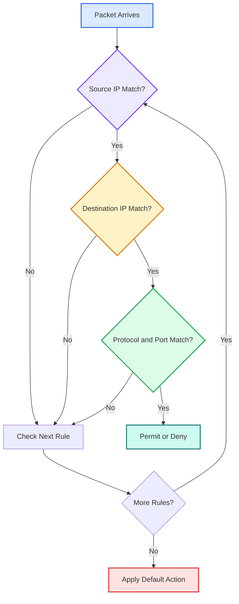
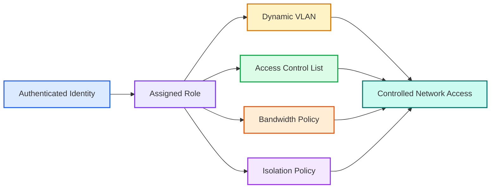
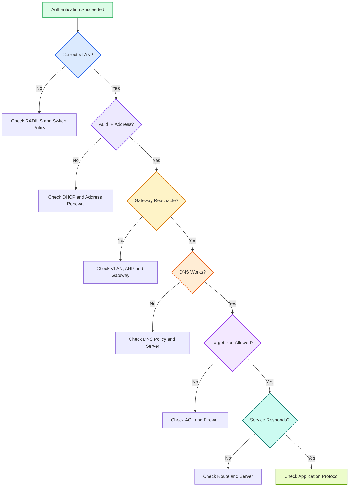

# 🌐 第 5 课：VLAN、ACL 与角色授权

> 🎯 **本节目标**
>
> 上一课我们学习了 EAP-TLS：设备如何用证书和私钥证明身份。
>
> 但是，认证成功只说明：
>
> > 🪪 **网络已经知道“你是谁”。**
>
> 网络还需要继续决定：
>
> > 🔐 **你可以进入哪个网络？能访问哪些服务器？可以使用哪些协议和端口？**
>
> 这一课重点讲清：
>
> * 什么是授权
> * 什么是 IP 网段和广播域
> * VLAN 是什么，为什么要划分 VLAN
> * ACL 是什么，它能限制什么
> * Role（角色）是什么
> * VLAN、ACL、Role 如何配合
> * 为什么设备认证成功后仍可能拿不到 IP 或访问不了业务服务器
> * 数字通信设备开发中应该如何记录、判断和排查授权问题

---

## 1. 🧭 认证成功之后发生什么？

在 802.1X 和 EAP-TLS 中，设备完成认证后，RADIUS 服务器可能返回：

```text
Authentication Result: Success
VLAN: 200
Role: Industrial-Gateway
ACL: Allow-MQTT-NTP-DNS
```

这些内容并不是再次认证，而是在进行：

# 🔐 Authorization——授权

授权要回答的问题包括：

* 设备应该进入哪个网络区域？
* 设备能访问哪些服务器？
* 允许哪些协议和端口？
* 是否限制设备互相访问？
* 是否限制带宽或接入时间？
* 是否需要进入隔离网络？

> ✅ <span style="color:#16a34a;font-weight:bold;">认证决定“身份是否可信”，授权决定“可信身份能做什么”。</span>

---

## 2. 🧩 基础概念：什么是 IP 网段？

假设有两台设备：

```text
Device A: 192.168.10.20
Device B: 192.168.10.30
```

它们通常属于同一个 IP 网段：

```text
192.168.10.0/24
```

而下面这台服务器：

```text
Server C: 192.168.20.10
```

通常属于另一个网段：

```text
192.168.20.0/24
```

初学阶段可以先这样理解：

> 🌐 **IP 网段就是一组在网络结构上被划分到同一区域的 IP 地址。**

同一网段中的设备，通常可以较直接地互相通信。

不同网段之间通信，通常需要经过：

* 路由器
* 三层交换机
* 防火墙
* 网关设备

---

## 3. 🚪 什么是默认网关？

设备想访问不同网段时，需要把数据交给一个网络出口。

这个出口就是：

```text
Default Gateway
```

中文叫：

> **默认网关**

例如：

```text
Device IP:       192.168.10.20
Subnet Mask:     255.255.255.0
Default Gateway: 192.168.10.1
```

当设备访问 `192.168.20.10` 时，会发现目标不在本地网段，于是把数据交给 `192.168.10.1`。

可以把默认网关理解为：

> 🚪 **本地网络通往其他网络的出口。**

---

## 4. 📣 什么是广播？

以太网中有些报文不是只发给某一台设备，而是发给当前网络范围内的所有设备。

这叫：

```text
Broadcast
```

常见广播或类似广播用途的报文包括：

* ARP 查询
* 某些 DHCP 报文
* 部分设备发现协议

广播范围过大会带来：

* 无关设备收到大量报文
* 网络负担增加
* 故障影响范围扩大
* 安全隔离能力变差

因此，网络通常不会把所有设备都放进一个巨大的二层网络。

---

## 5. 🧱 什么是 VLAN？

VLAN 的全称是：

```text
Virtual Local Area Network
```

中文叫：

> <span style="color:#2563eb;font-weight:bold;">虚拟局域网</span>

它的主要作用是：

> 在同一套交换机网络中，把设备逻辑上划分成不同的网络区域。

例如：

| VLAN    | 设备类型   | 示例网段              |
| ------- | ------ | ----------------- |
| VLAN 10 | 办公电脑   | `192.168.10.0/24` |
| VLAN 20 | 摄像头    | `192.168.20.0/24` |
| VLAN 30 | 工业网关   | `192.168.30.0/24` |
| VLAN 40 | 访客设备   | `192.168.40.0/24` |
| VLAN 99 | 网络管理设备 | `192.168.99.0/24` |

虽然这些设备可能连接在同一台交换机上，但它们在逻辑上属于不同网络。

---

## 6. 🏢 用办公楼理解 VLAN

可以把一台大型交换机理解成一栋办公楼。

如果没有 VLAN，所有人都在一个巨大的开放区域中。

使用 VLAN 后，就像把办公楼划分成：

* 研发区
* 财务区
* 访客区
* 生产区
* 设备管理区

不同区域之间不能随意走动，需要经过门禁和通道检查。

> 🧠 <span style="color:#7c3aed;font-weight:bold;">VLAN 负责“分区”，ACL 和防火墙负责“控制不同区域之间能否通信”。</span>

---

## 7. 🔒 VLAN 能解决什么问题？

### 7.1 缩小广播范围

VLAN 可以把广播限制在较小范围内。

例如，摄像头 VLAN 的广播一般不会直接传播到办公电脑 VLAN。

---

### 7.2 隔离不同类型的设备

可以把以下设备放入不同 VLAN：

* 摄像头
* 工业控制器
* 访客手机
* 研发电脑
* 管理终端

这样可以减少设备之间的互相干扰和安全风险。

---

### 7.3 方便实施安全策略

设备被划分到明确的 VLAN 后，防火墙和路由策略更容易控制。

例如：

```text
VLAN 30 只能访问 MQTT Broker
VLAN 40 只能访问互联网
VLAN 99 只允许管理员访问
```

---

### 7.4 降低故障影响范围

如果某个 VLAN 出现广播风暴、二层环路或异常设备，影响范围通常比整个网络更小。

---

## 8. ⚠️ VLAN 不是完整的安全机制

VLAN 能完成网络分区，但它并不等于完整安全。

如果不同 VLAN 之间的路由完全开放，那么设备仍然可能互相访问。

因此，常见做法是：

```text
VLAN 分区
    +
ACL / Firewall 限制
```

> 🚨 <span style="color:#dc2626;font-weight:bold;">VLAN 负责把设备分开，但还需要 ACL 或防火墙决定“分开以后能不能互相访问”。</span>

---

## 9. 🔄 什么是动态 VLAN？

在传统网络中，一个交换机端口可能被固定配置为某个 VLAN。

例如：

```text
Switch Port 8 → VLAN 30
```

无论谁插入这个端口，都进入 VLAN 30。

而在 NAC 和 802.1X 环境中，可以使用：

```text
Dynamic VLAN Assignment
```

也就是：

> 根据认证结果，动态决定设备进入哪个 VLAN。

同一个交换机端口接入不同设备时，结果可能不同：

| 接入设备 | 认证结果   | 分配 VLAN     |
| ---- | ------ | ----------- |
| 工业网关 | 合法工业设备 | VLAN 30     |
| 研发电脑 | 合法研发终端 | VLAN 10     |
| 未知设备 | 无法识别   | VLAN 80 隔离区 |
| 访客设备 | 访客认证通过 | VLAN 40     |

这样，网络权限主要跟设备身份和策略绑定，而不是简单跟物理端口绑定。

---

## 10. 🚦 什么是 ACL？

ACL 的全称是：

```text
Access Control List
```

中文叫：

> <span style="color:#16a34a;font-weight:bold;">访问控制列表</span>

ACL 是一组流量匹配和处理规则。

它通常会判断：

* 源 IP 是什么
* 目标 IP 是什么
* 使用什么协议
* 目标端口是多少
* 应该允许还是拒绝

一个简单 ACL 可以表示为：

```text
允许 192.168.30.0/24 访问 10.20.0.10 TCP 8883
允许 192.168.30.0/24 访问 10.20.0.20 UDP 123
拒绝 192.168.30.0/24 访问 192.168.10.0/24
拒绝其他未明确允许的流量
```

---

## 11. 📦 ACL 中的“端口”是什么？

这里的端口不是交换机上的物理网口，而是：

```text
TCP / UDP Port
```

也就是 TCP 或 UDP 端口号。

常见例子：

| 协议或服务 |       端口示例 | 用途          |
| ----- | ---------: | ----------- |
| HTTPS |    TCP 443 | 加密网页或 API   |
| SSH   |     TCP 22 | 远程管理        |
| DNS   | UDP/TCP 53 | 域名解析        |
| NTP   |    UDP 123 | 时间同步        |
| MQTT  |   TCP 1883 | 普通 MQTT     |
| MQTTS |   TCP 8883 | TLS 加密 MQTT |
| DHCP  |  UDP 67/68 | 自动获取 IP     |

例如：

```text
Allow TCP 8883
```

表示允许访问使用 TCP 8883 的服务。

> ⚠️ 一个业务能否访问，往往同时取决于目标 IP、传输协议和端口号。

---

## 12. 🧠 ACL 如何判断流量？

可以把 ACL 想象成路口的一张检查表。



初学阶段需要记住两个重点：

1. ACL 规则通常按照顺序匹配
2. 很多 ACL 最后会有一个默认拒绝逻辑

---

## 13. 🚨 什么是“默认拒绝”？

安全策略中经常采用：

```text
Default Deny
```

中文可以理解为：

> 没有明确允许的流量，一律拒绝。

例如设备真正需要的服务只有：

* DNS
* NTP
* MQTT Broker

那么策略可以只允许这三类通信，其他全部拒绝。

这符合：

# 🔐 最小权限原则

> <span style="color:#7c3aed;font-weight:bold;">设备只获得完成工作所必需的最少网络权限。</span>

---

## 14. 🎭 什么是 Role（角色）？

Role 可以理解为：

> 一组已经打包好的网络权限模板。

例如定义一个角色：

```text
Role: Industrial-Gateway
```

这个角色中可能包含：

```text
VLAN: 30
ACL: Allow-DNS-NTP-MQTTS
Bandwidth: 20 Mbps
Session Timeout: 24 Hours
Isolation: Enabled
```

当 NAC 判断某台设备是工业网关时，就可以直接给它分配这个角色。

---

## 15. 🧰 为什么需要角色？

如果每台设备都单独配置 VLAN 和 ACL，管理会非常复杂。

例如有 5 万台设备：

```text
每台设备单独配置策略
```

会带来：

* 配置量巨大
* 容易出错
* 不方便统一修改
* 难以审计

使用角色后，可以变成：

```text
设备身份 → 设备类型 → 角色 → 一组统一策略
```

例如：

| 角色                 | VLAN | 访问权限          |
| ------------------ | ---: | ------------- |
| Industrial-Gateway |   30 | DNS、NTP、MQTTS |
| Camera             |   20 | 视频平台、DNS、NTP  |
| Developer-PC       |   10 | 研发平台、互联网      |
| Guest              |   40 | 仅互联网          |
| Quarantine         |   80 | 仅升级和修复服务器     |

> ✅ <span style="color:#16a34a;font-weight:bold;">角色让大量同类设备可以使用统一、可维护的授权策略。</span>

---

## 16. 🔗 VLAN、ACL 和 Role 是什么关系？

它们不是互相替代，而是互相配合。

| 技术   | 主要作用        | 简单类比    |
| ---- | ----------- | ------- |
| VLAN | 把设备放到不同网络区域 | 分配到不同楼层 |
| ACL  | 控制流量是否允许通过  | 门口访问规则  |
| Role | 把多种权限组合成模板  | 员工权限套餐  |



---

## 17. 🏭 工业网关授权示例

假设工业网关完成 EAP-TLS 认证。

RADIUS 返回：

```text
Authentication: Success
Role: Industrial-Gateway
VLAN: 30
ACL: IGW-Minimum-Access
```

ACL 内容为：

```text
Allow DNS Server         UDP/TCP 53
Allow NTP Server         UDP 123
Allow MQTT Broker        TCP 8883
Allow Management Server  TCP 443
Deny Office Network
Deny Other Traffic
```

最终结果：

* 网关可以进行域名解析
* 网关可以同步时间
* 网关可以连接 MQTT Broker
* 网关可以访问设备管理平台
* 网关不能访问办公电脑
* 网关不能扫描其他业务网段

---

## 18. 📡 授权如何影响 DHCP？

DHCP 用于自动获取：

* IP 地址
* 子网掩码
* 默认网关
* DNS 服务器

常见流程是：

```text
802.1X Authentication
    ↓
VLAN Assigned
    ↓
DHCP Request
    ↓
IP Address Obtained
```

为什么要先分配 VLAN？

因为不同 VLAN 通常对应不同：

* IP 网段
* DHCP 地址池
* 默认网关
* DNS 配置
* 安全策略

例如：

| VLAN    | DHCP 地址池          |
| ------- | ----------------- |
| VLAN 10 | `192.168.10.0/24` |
| VLAN 20 | `192.168.20.0/24` |
| VLAN 30 | `192.168.30.0/24` |
| VLAN 80 | `192.168.80.0/24` |

如果设备被分配到 VLAN 30，它应该从 VLAN 30 对应的 DHCP 地址池获取地址。

---

## 19. ⚠️ 为什么认证成功却拿不到 IP？

可能原因包括：

* VLAN 没有正确下发
* 交换机没有正确应用 VLAN
* 对应 VLAN 没有 DHCP 服务
* DHCP Relay 配置错误
* ACL 错误阻止 DHCP
* 设备仍保留旧 VLAN 的 IP
* 设备在 VLAN 变化后没有重新发起 DHCP
* 交换机端口策略异常

因此：

> 🚨 <span style="color:#dc2626;font-weight:bold;">认证成功只能证明身份通过，不代表 IP 配置一定成功。</span>

---

## 20. 🔄 VLAN 变化后为什么可能要重新获取 IP？

假设设备认证前位于隔离 VLAN：

```text
VLAN 80
IP: 192.168.80.25
```

认证成功后，网络把设备切换到业务 VLAN：

```text
VLAN 30
```

但设备仍然保留：

```text
192.168.80.25
```

这个地址不属于 VLAN 30，通常不能正常通信。

因此设备可能需要：

```text
VLAN Changed
    ↓
Release Old IP
    ↓
Restart DHCP
    ↓
Obtain New IP
```

设备开发时应关注：

* 能否感知链路或授权状态变化
* 是否在认证成功后重新启动 DHCP
* 是否清除旧路由、旧 DNS 和旧网关
* VLAN 变化后业务连接是否重新建立

---

## 21. 🚫 为什么认证成功却访问不了业务服务器？

常见原因包括：

| 层次   | 可能问题                |
| ---- | ------------------- |
| VLAN | 进入了错误 VLAN          |
| DHCP | 没拿到正确 IP、网关或 DNS    |
| ACL  | 目标 IP 或端口未被允许       |
| 路由   | 没有到目标网段的路由          |
| 防火墙  | 跨网段流量被阻止            |
| DNS  | 域名无法解析              |
| 服务端  | 服务没有监听或服务器故障        |
| TLS  | 业务证书校验失败            |
| 应用层  | MQTT、HTTP 或私有协议登录失败 |

所以，“认证成功”只说明接入流程完成了一部分。

---

## 22. 🧯 授权后业务不通的排障流程



排查顺序可以记成：

```text
认证结果
    ↓
VLAN
    ↓
IP / DHCP
    ↓
默认网关
    ↓
DNS
    ↓
ACL / 防火墙
    ↓
服务器
    ↓
应用协议
```

---

## 23. 🛠️ 面向设备开发，需要重点关注什么？

### 23.1 不要只提供“在线 / 离线”两个状态

建议区分：

```text
AUTHENTICATED
AUTHORIZED
VLAN_APPLIED
IP_CONFIGURING
IP_READY
NETWORK_REACHABLE
SERVICE_CONNECTED
```

因为：

* 认证成功不等于授权完成
* 授权完成不等于 IP 就绪
* IP 就绪不等于服务器可达
* 服务器可达不等于业务登录成功

---

### 23.2 记录当前网络参数

建议日志或诊断接口能够查看：

* 当前 IP 地址
* 子网掩码
* 默认网关
* DNS 服务器
* 当前 VLAN 或网络角色
* DHCP 成功与否
* 目标服务器 IP 和端口
* 最近一次连接失败原因

---

### 23.3 记录策略变化

例如：

```text
[10:01:09] Authentication succeeded
[10:01:10] Role assigned: Industrial-Gateway
[10:01:10] VLAN changed: 80 -> 30
[10:01:11] Releasing old DHCP lease
[10:01:12] Starting DHCP on authorized network
[10:01:14] IP obtained: 192.168.30.25
[10:01:15] Default gateway: 192.168.30.1
[10:01:17] MQTT connection established
```

这样的日志能清楚说明每一步是否成功。

---

### 23.4 不要把所有失败都写成 `Network Error`

不推荐：

```text
Network Error
Connection Failed
```

更推荐：

```text
Authentication rejected
VLAN assignment missing
DHCP timeout
Default gateway unreachable
DNS resolution failed
TCP connection refused
TCP connection timed out
TLS certificate verification failed
MQTT authentication failed
```

> ✅ <span style="color:#16a34a;font-weight:bold;">错误信息越能指出具体阶段，现场排障效率越高。</span>

---

### 23.5 权限变化时要重建业务连接

当网络角色、VLAN、IP 或路由发生变化时，原有连接可能已经失效。

设备可能需要：

* 关闭旧 Socket
* 清除 DNS 缓存
* 重新获取 IP
* 重新解析域名
* 重新建立 TCP/TLS
* 重新登录 MQTT、HTTP 或其他平台

---

## 24. ⚠️ 初学者容易混淆的地方

### 24.1 VLAN 和 IP 网段不是完全相同的概念

VLAN 主要属于二层网络划分。

IP 网段属于三层地址规划。

工程中通常会设计成：

```text
一个 VLAN 对应一个 IP 网段
```

但它们本质上不是同一个概念。

---

### 24.2 ACL 和防火墙不是完全相同

ACL 一般用于较直接的允许或拒绝规则。

防火墙通常还可以提供：

* 连接状态跟踪
* 应用识别
* NAT
* 更复杂的安全检查
* 日志和威胁防护

初学阶段可以先理解为：

```text
ACL = 基础流量规则
Firewall = 更完整的安全控制系统
```

---

### 24.3 能 Ping 通不代表业务一定正常

Ping 通常使用 ICMP。

而业务可能使用：

* TCP 443
* TCP 8883
* UDP 123
* 私有协议端口

ACL 可能允许 Ping，却禁止业务端口。

反过来，也可能禁止 Ping，但允许业务端口。

> ⚠️ <span style="color:#ea580c;font-weight:bold;">Ping 只是网络诊断手段之一，不能单独证明所有业务流量都正常。</span>

---

### 24.4 获取 IP 不代表授权完全正确

设备可能位于：

* 访客 VLAN
* 隔离 VLAN
* 错误业务 VLAN
* 临时修复 VLAN

这些网络也可能提供 DHCP。

因此拿到 IP 后，还需要检查：

* IP 属于哪个网段
* 默认网关是什么
* DNS 是什么
* 能访问哪些目标
* 当前角色和 ACL 是否正确

---

### 24.5 Role 不是设备自己声明了就可信

设备可以声称：

```text
我是 Industrial-Gateway
```

但网络不能直接相信。

角色通常应该根据以下信息综合决定：

* 认证身份
* 证书信息
* 资产系统记录
* 设备类型识别
* 管理员策略

---

## 25. 🧠 本节记忆口诀

```text
VLAN 负责分区
ACL 负责放行或阻止
Role 负责打包一整套权限
```

再完整一点：

```text
认证确认身份
角色匹配策略
VLAN 决定进入哪个区域
ACL 决定可以访问什么
DHCP 提供网络参数
业务连接最后建立
```

---

## 26. 📝 自测题

### 题目 1

设备通过 EAP-TLS 认证后，被分配到 VLAN 30。这个动作属于认证还是授权？

**答案：**

属于授权。

认证已经确认设备身份，分配 VLAN 是根据身份决定网络权限。

---

### 题目 2

VLAN 30 中的设备是否一定不能访问 VLAN 10？

**答案：**

不一定。

是否可以跨 VLAN 访问，还要看路由、ACL 和防火墙策略。

---

### 题目 3

设备认证成功但拿不到 IP，可能有哪些原因？

**答案：**

可能包括：

* VLAN 未正确下发
* VLAN 中没有 DHCP
* DHCP Relay 错误
* ACL 阻止 DHCP
* 设备没有重新启动 DHCP
* 交换机策略未正确应用

---

### 题目 4

设备可以 Ping 通服务器，但无法连接 TCP 8883，说明什么？

**答案：**

说明基础 IP 路径可能存在，但 TCP 8883 业务仍可能被 ACL、防火墙或服务器状态阻止。

Ping 通不代表所有端口都开放。

---

### 题目 5

Role 的主要作用是什么？

**答案：**

Role 用来把 VLAN、ACL、带宽、隔离等多种权限组合成一个统一策略模板，方便批量管理同类设备。

---

## 27. ✅ 本节总结

| 图标  | 概念       | 主要作用             |
| --- | -------- | ---------------- |
| 🧱  | VLAN     | 把设备划分到不同网络区域     |
| 🚦  | ACL      | 控制哪些流量允许或拒绝      |
| 🎭  | Role     | 将多种权限组合成策略模板     |
| 🌐  | DHCP     | 为设备提供 IP、网关和 DNS |
| 🧭  | Routing  | 负责不同网段之间的数据转发    |
| 🛡️ | Firewall | 执行更完整的跨网络安全控制    |

设备完整入网流程可以概括为：

```mermaid
flowchart LR
    A[Identity Authentication] --> B[Role Assignment]
    B --> C[VLAN and ACL Applied]
    C --> D[DHCP Configuration]
    D --> E[Routing and Policy Check]
    E --> F[Business Connection]

    style A fill:#dbeafe,stroke:#2563eb,stroke-width:2px
    style B fill:#ede9fe,stroke:#7c3aed,stroke-width:2px
    style C fill:#dcfce7,stroke:#16a34a,stroke-width:2px
    style D fill:#fef3c7,stroke:#d97706,stroke-width:2px
    style E fill:#ffedd5,stroke:#ea580c,stroke-width:2px
    style F fill:#ccfbf1,stroke:#0f766e,stroke-width:2px
```



---

## 🌟 一句话总结

> <span style="color:#7c3aed;font-weight:bold;">认证成功只是证明设备身份合法；VLAN 决定设备进入哪个网络区域，ACL 决定它能访问什么，Role 则把这些权限组合成一套统一策略。</span>

---

## 📌 下一课预告

# 第 6 课：设备开发中的证书、密钥、异常处理与日志

下一课会重点讲解：

* 每台设备为什么应该有独立身份
* 证书和私钥如何写入设备
* 为什么不能把私钥写死在固件中
* 安全芯片、TPM、Secure Element 是什么
* 证书过期、更新和吊销如何处理
* 认证失败时设备状态机如何设计
* 重试、退避和网络恢复机制
* 一套实用的接入认证日志应该记录什么
* 设备现场问题如何按阶段快速定位
