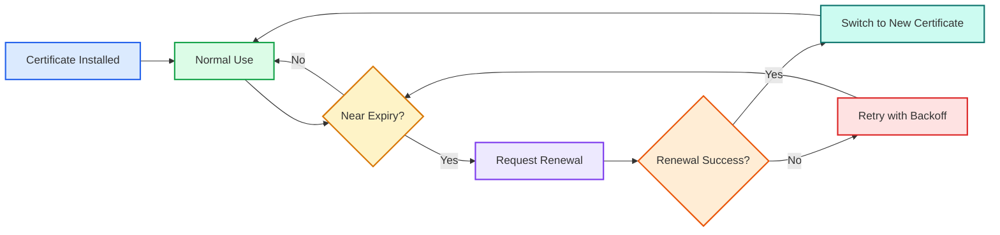
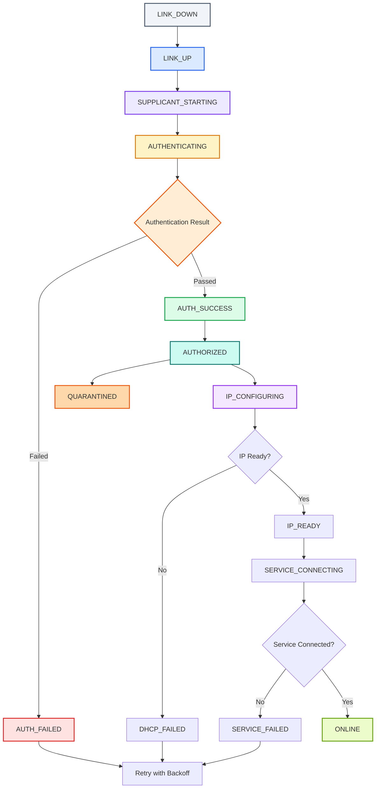
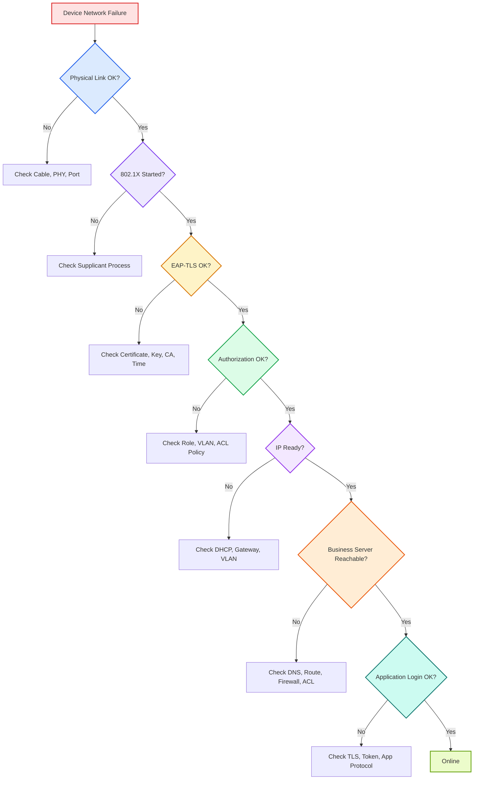

# 🌐 第 6 课：设备开发中的证书、密钥、异常处理与日志排障

> 🎯 **本节目标**
>
> 前面我们已经学习了：
>
> * 🪪 认证、授权、审计
> * 🛡️ NAC 网络接入控制
> * 🔐 802.1X 三个角色
> * 📜 EAP-TLS 和证书认证
> * 🧱 VLAN、ACL、Role 授权结果
>
> 这一讲把这些知识落到**数字通信设备开发**中，重点回答：
>
> * 设备身份从哪里来？
> * 证书和私钥怎么管理？
> * 为什么不能把私钥写死在固件里？
> * 证书过期、吊销、更新怎么处理？
> * 认证失败时设备应该如何重试？
> * 设备日志应该记录什么？
> * 现场排障应该按什么顺序查？

---

## 1. 🧭 为什么设备开发人员必须关心接入认证？

在通信设备、工业网关、IoT 终端、专网设备中，设备不是简单地“联网成功”就结束了。

真正工程上要关心的是：

```text
这台设备是不是合法设备？
它的身份凭据安全吗？
它接入失败时能不能定位原因？
它证书过期时能不能恢复？
它被分配了什么网络权限？
它的行为能不能被追踪？
```

也就是说，设备开发不能只看：

```text
能不能 ping 通？
能不能连接服务器？
```

还要看：

* 🪪 身份是否可信
* 🔑 密钥是否安全
* 📜 证书是否有效
* 🔐 权限是否正确
* 🔄 异常是否可恢复
* 📝 日志是否可排障

> 🌟 <span style="color:#7c3aed;font-weight:bold;">对数字通信设备来说，网络接入认证不是附加功能，而是设备可靠性和安全性的一部分。</span>

---

## 2. 🪪 每台设备为什么应该有独立身份？

如果所有设备都使用同一个账号、同一个密码、同一个证书或同一个私钥，会带来很大风险。

例如：

```text
设备 A 的私钥泄露
    ↓
攻击者可以伪装成设备 A
    ↓
如果所有设备共用私钥
    ↓
攻击者可能伪装成所有设备
```

这非常危险。

更合理的做法是：

```text
一台设备 = 一个独立身份 = 一套独立凭据
```

设备身份可以包括：

| 类型               | 作用            |
| ---------------- | ------------- |
| 🆔 设备序列号         | 标识设备出厂编号      |
| 📜 设备证书          | 用于证明设备身份      |
| 🔑 设备私钥          | 用于证明设备确实拥有该证书 |
| 🧩 安全芯片唯一密钥      | 用硬件保护设备身份     |
| 📶 SIM / eSIM 身份 | 用于蜂窝通信网络      |
| 🗃️ 资产系统记录       | 记录设备属于谁、能接入哪里 |

> ✅ <span style="color:#16a34a;font-weight:bold;">设备身份要做到“唯一、可验证、可撤销、可追踪”。</span>

---

## 3. 📜 证书和私钥在设备里分别是什么？

再次强调一个非常重要的区别：

| 内容                | 是否保密      | 作用           |
| ----------------- | --------- | ------------ |
| 📜 证书 Certificate | 通常不需要严格保密 | 对外展示设备身份     |
| 🔑 私钥 Private Key | 必须严格保密    | 证明设备确实拥有该身份  |
| 🏛️ CA 证书         | 不保密       | 用于验证对方证书是否可信 |

可以这样类比：

```text
证书 = 身份证
私钥 = 只有本人才能完成的签名能力
CA = 发证机关
```

设备在 EAP-TLS 认证时，不是把私钥发出去，而是用私钥完成证明。

> 🚨 <span style="color:#dc2626;font-weight:bold;">私钥绝对不能出现在日志、抓包、配置导出文件或固件包中。</span>

---

## 4. 🏭 证书和私钥从哪里来？

设备证书和私钥通常有几种来源。

| 方式         | 简单说明           | 适用场景      |
| ---------- | -------------- | --------- |
| 🏭 产线烧录    | 出厂时写入证书和私钥     | 工业设备、通信终端 |
| 🧩 安全芯片预置  | 私钥在安全芯片中生成或保存  | 高安全设备     |
| 🌐 首次开机注册  | 设备首次联网后向平台申请证书 | IoT、云管理设备 |
| 🛠️ 运维工具导入 | 现场通过工具写入证书     | 实验室、专网设备  |
| 🔁 远程更新    | 设备运行中更新证书      | 长生命周期设备   |

实际项目中要明确：

```text
证书什么时候生成？
由谁签发？
如何写入设备？
是否允许导出？
如何更新？
如何吊销？
恢复出厂后是否保留？
```

---

## 5. 🔑 为什么不能把私钥写死在固件里？

有些初学者可能会想：

```text
把证书和私钥直接放进固件里，不就简单了吗？
```

这在安全上非常危险。

因为固件可能被：

* 下载
* 反编译
* 提取文件系统
* 从 Flash 中读取
* 通过调试接口导出

如果私钥写死在固件里，一旦固件泄露，所有使用该固件的设备身份都可能被冒充。

### ❌ 不推荐做法

```text
所有设备使用同一个私钥
私钥写死在代码中
私钥明文放在普通 Flash
私钥出现在日志中
调试接口可以读取私钥
```

### ✅ 更推荐做法

```text
每台设备独立密钥
私钥不可导出
使用安全芯片或安全存储
生产后关闭危险调试接口
证书和密钥支持更新
密钥操作尽量在安全区域完成
```

> 🚨 <span style="color:#dc2626;font-weight:bold;">私钥一旦泄露，设备身份就不再可信。</span>

---

## 6. 🛡️ 安全芯片、TPM、Secure Element、TEE 是什么？

这些名词不需要一开始学得很深，先理解它们的作用即可：

> 它们的核心目标都是：**保护密钥，让私钥不容易被偷走。**

| 名称                | 简单理解                      |
| ----------------- | ------------------------- |
| 🧩 Secure Element | 专门保护密钥的小安全芯片              |
| 🛡️ TPM           | 常见于 PC、服务器和部分嵌入式系统的可信平台模块 |
| 🔐 TEE            | 处理器中的可信执行环境               |
| 🔑 安全存储           | 用硬件或系统机制保护敏感数据            |
| 🧱 HSM            | 更高级的硬件安全模块，常用于服务器侧或证书系统   |

初学阶段可以先记住：

```text
普通 Flash：容易被读出，不适合直接明文存私钥
安全芯片：更适合保护私钥
不可导出私钥：比“文件形式保存私钥”更安全
```

---

## 7. ⏳ 证书为什么会过期？

证书通常都有有效期。

例如：

```text
Not Before: 2026-01-01
Not After:  2028-01-01
```

这表示证书只在这段时间内有效。

为什么证书要设置有效期？

* 降低长期泄露风险
* 方便定期更新加密材料
* 方便淘汰旧算法或旧设备
* 避免设备永久持有接入资格
* 满足安全管理要求

> ⏱️ <span style="color:#ea580c;font-weight:bold;">设备生命周期可能是 10 年，但证书有效期可能只有 1 到 3 年，所以设备必须考虑证书更新。</span>

---

## 8. 🕒 设备时间错误为什么会导致认证失败？

证书校验依赖时间。

如果设备时间错误，可能出现两种问题：

### 情况 1：设备时间太早

```text
当前设备时间：2020-01-01
证书生效时间：2026-01-01
```

设备可能认为：

```text
证书还没生效
```

### 情况 2：设备时间太晚

```text
当前设备时间：2035-01-01
证书过期时间：2028-01-01
```

设备可能认为：

```text
证书已经过期
```

因此设备开发中要考虑：

* 是否有 RTC 实时时钟
* 是否有可信时间源
* 认证前能否访问 NTP
* 没有网络时间时如何处理证书校验
* 时间异常时日志是否清楚

> ⚠️ <span style="color:#ea580c;font-weight:bold;">很多证书认证失败，本质上不是证书坏了，而是设备时间错了。</span>

---

## 9. 🔁 证书更新应该怎么考虑？

设备证书不能等到彻底过期后才处理。

更合理的做法是提前更新。



设备更新证书时要考虑：

* 新证书下载失败怎么办
* 更新过程中断电怎么办
* 新证书写入失败怎么办
* 新旧证书如何切换
* 是否需要回滚
* 更新后是否立即重新认证
* 是否保留旧证书一段时间作为备用

> ✅ <span style="color:#16a34a;font-weight:bold;">证书更新要尽量做到可恢复、可回滚、可诊断。</span>

---

## 10. 🚫 证书吊销是什么？

如果一台设备丢失、被盗、退役或被确认私钥泄露，不能只是“不再使用它”。

还应该让网络知道：

```text
这张证书以后不再可信。
```

这就是证书吊销。

吊销的目的：

* 阻止丢失设备继续接入
* 阻止被攻击设备继续使用旧身份
* 阻止已退役设备再次进入网络
* 支持资产生命周期管理

常见吊销检查方式包括：

| 方式   | 简单理解          |
| ---- | ------------- |
| CRL  | 一张被吊销证书列表     |
| OCSP | 在线查询某张证书是否仍有效 |

初学阶段只需要理解：

> 🚫 <span style="color:#dc2626;font-weight:bold;">证书没有过期，不代表一定还能用；如果被吊销，也应该认证失败。</span>

---

## 11. 🔄 设备接入认证的状态机设计

设备软件最好不要只有：

```text
ONLINE
OFFLINE
```

这太粗糙了。

建议把网络接入过程拆成多个状态。

```text
LINK_DOWN
LINK_UP
SUPPLICANT_STARTING
AUTHENTICATING
AUTH_SUCCESS
AUTH_FAILED
AUTHORIZED
IP_CONFIGURING
IP_READY
SERVICE_CONNECTING
ONLINE
QUARANTINED
```

| 状态                    | 含义                     |
| --------------------- | ---------------------- |
| `LINK_DOWN`           | 物理链路未建立                |
| `LINK_UP`             | 网线连接或无线连接已建立           |
| `SUPPLICANT_STARTING` | 802.1X 客户端正在启动         |
| `AUTHENTICATING`      | 正在认证                   |
| `AUTH_SUCCESS`        | 身份认证成功                 |
| `AUTH_FAILED`         | 身份认证失败                 |
| `AUTHORIZED`          | VLAN、ACL、Role 等授权策略已应用 |
| `IP_CONFIGURING`      | 正在 DHCP 或配置 IP         |
| `IP_READY`            | IP、网关、DNS 已准备好         |
| `SERVICE_CONNECTING`  | 正在连接业务服务器              |
| `ONLINE`              | 业务连接正常                 |
| `QUARANTINED`         | 设备被放入隔离网络              |

> 🧠 <span style="color:#7c3aed;font-weight:bold;">状态拆得越清楚，问题越容易定位。</span>

---

## 12. 🔄 完整设备入网状态流程



---

## 13. ❌ 认证失败时，不要只写“失败”

不推荐日志：

```text
Authentication failed
Network error
Connect failed
```

这些信息太笼统，现场工程师很难定位。

更推荐区分失败原因：

| 失败类型      | 推荐日志                                             |
| --------- | ------------------------------------------------ |
| 证书不存在     | `Device certificate not found`                   |
| 私钥不可读     | `Private key access denied`                      |
| 证书过期      | `Device certificate expired`                     |
| 时间错误      | `System time invalid for certificate validation` |
| CA 不可信    | `Server certificate chain untrusted`             |
| RADIUS 拒绝 | `Authentication rejected by RADIUS`              |
| 服务器不可达    | `RADIUS server timeout`                          |
| VLAN 未下发  | `No VLAN attribute received`                     |
| DHCP 失败   | `DHCP timeout after authorization`               |
| ACL 阻止    | `Connection blocked or timed out to target port` |

> ✅ <span style="color:#16a34a;font-weight:bold;">日志要能说明失败发生在哪个阶段，而不是只告诉你“失败了”。</span>

---

## 14. 🔁 认证失败后的重试机制

设备认证失败后，不能疯狂重试。

不推荐：

```text
失败
立即重试
失败
立即重试
失败
立即重试
```

这会造成：

* 认证服务器压力变大
* 网络负载变高
* 日志爆炸
* 设备功耗增加
* 可能触发安全系统告警

更合理的是：

```text
失败后等待一小段时间
再次失败后等待更久
多次失败后进入稳定退避
网络变化或配置变化时重新尝试
```

这叫：

```text
Backoff
```

可以理解为：

> 🔄 **失败后逐步拉长重试间隔。**

例如：

```text
第 1 次失败：5 秒后重试
第 2 次失败：15 秒后重试
第 3 次失败：30 秒后重试
第 4 次失败：60 秒后重试
之后每 5 分钟重试一次
```

---

## 15. 🧯 哪些情况应该立即重试？哪些情况不该频繁重试？

| 情况          | 是否适合频繁重试  | 说明             |
| ----------- | --------- | -------------- |
| 网线刚恢复       | ✅ 可以立即尝试  | 网络状态发生变化       |
| 认证服务器短暂超时   | ✅ 可以有限重试  | 可能是临时网络问题      |
| 证书文件缺失      | ❌ 不应频繁重试  | 重试也不会自动恢复      |
| 私钥不匹配       | ❌ 不应频繁重试  | 需要重新配置凭据       |
| 证书过期        | ❌ 不应盲目重试  | 应进入更新流程        |
| 设备时间无效      | ⚠️ 先修正时间  | 需要 RTC/NTP     |
| RADIUS 明确拒绝 | ⚠️ 降低重试频率 | 可能是策略拒绝        |
| DHCP 超时     | ✅ 可适度重试   | 可能是网络或 VLAN 问题 |

> 🧠 <span style="color:#7c3aed;font-weight:bold;">可恢复的临时错误可以重试；配置类、凭据类错误不应无限快速重试。</span>

---

## 16. 🧱 VLAN 或网络角色变化后，设备要做什么？

认证成功后，网络可能给设备分配新的 VLAN 或角色。

这时设备原来的网络参数可能已经失效。

例如：

```text
认证前：VLAN 80，IP = 192.168.80.25
认证后：VLAN 30，应该重新获取 192.168.30.x
```

设备应该考虑：

* 释放旧 DHCP 地址
* 重新获取 IP
* 更新默认网关
* 更新 DNS
* 清理旧连接
* 重新解析域名
* 重新建立业务连接

推荐日志：

```text
[10:01:09] Authentication succeeded
[10:01:10] Role assigned: Industrial-Gateway
[10:01:10] VLAN changed: 80 -> 30
[10:01:11] Releasing old DHCP lease
[10:01:12] Starting DHCP
[10:01:14] IP obtained: 192.168.30.25
[10:01:15] Gateway: 192.168.30.1
[10:01:16] DNS: 192.168.30.53
[10:01:18] MQTT connected
```

---

## 17. 📝 一套实用日志应该记录什么？

建议至少记录这些信息。

### 17.1 链路阶段

```text
Ethernet link up/down
Interface speed
Duplex mode
PHY status
```

### 17.2 802.1X 阶段

```text
Supplicant started
EAPOL exchange started
EAP method selected
Authentication success/failure
RADIUS timeout or rejection
```

### 17.3 证书阶段

```text
Certificate loaded
Certificate subject
Certificate issuer
Certificate serial number
Certificate expiry time
CA chain validation result
Server certificate verification result
```

注意：

> ⚠️ 可以记录证书编号、签发者、过期时间，但不要记录私钥。

### 17.4 授权阶段

```text
Assigned role
Assigned VLAN
ACL name
Quarantine status
Policy change
```

### 17.5 IP 阶段

```text
DHCP started
DHCP success/failure
IP address
Subnet mask
Default gateway
DNS server
```

### 17.6 业务阶段

```text
Target server hostname
Resolved IP
Target port
TCP connected or timeout
TLS handshake result
Application login result
```

---

## 18. 🚨 日志中绝对不应该记录什么？

不要记录：

* ❌ 私钥
* ❌ 明文密码
* ❌ 完整 Token
* ❌ 预共享密钥
* ❌ 可直接冒充设备的凭据
* ❌ 完整敏感证书密钥材料
* ❌ 用户隐私数据
* ❌ 生产环境服务器敏感口令

可以记录：

* ✅ 证书序列号
* ✅ 证书过期时间
* ✅ 错误码
* ✅ 认证阶段
* ✅ 服务器地址
* ✅ 目标端口
* ✅ VLAN ID
* ✅ 角色名
* ✅ DHCP 结果

> 🌟 <span style="color:#7c3aed;font-weight:bold;">好日志应该帮助排障，不能变成新的安全漏洞。</span>

---

## 19. 🧯 现场排障总流程

当设备接入失败时，可以按下面顺序查。



排障口诀：

```text
先物理
再认证
看证书
看授权
查 IP
查路由
查端口
最后查业务协议
```

---

## 20. 🏭 工业网关完整接入示例

假设一台工业网关需要通过 802.1X + EAP-TLS 接入生产网络，然后连接 MQTT Broker。

### 20.1 正常流程

```text
[10:00:01] Ethernet link up
[10:00:02] 802.1X supplicant started
[10:00:03] EAP-TLS authentication started
[10:00:03] Device certificate loaded
[10:00:04] Server certificate verified
[10:00:05] Authentication success
[10:00:05] Role assigned: Industrial-Gateway
[10:00:05] VLAN assigned: 30
[10:00:06] DHCP started
[10:00:08] IP obtained: 192.168.30.25
[10:00:08] Gateway: 192.168.30.1
[10:00:09] DNS resolved mqtt.example.local -> 10.20.0.10
[10:00:10] TCP connected to 10.20.0.10:8883
[10:00:11] TLS handshake success
[10:00:12] MQTT connected
```

这表示完整链路正常：

```text
链路正常
认证成功
授权正确
IP 正常
DNS 正常
TCP 正常
TLS 正常
MQTT 正常
```

---

### 20.2 异常示例：认证成功但业务不通

```text
[10:00:01] Ethernet link up
[10:00:02] 802.1X supplicant started
[10:00:05] Authentication success
[10:00:05] VLAN assigned: 30
[10:00:08] IP obtained: 192.168.30.25
[10:00:09] DNS resolved mqtt.example.local -> 10.20.0.10
[10:00:20] TCP connect timeout to 10.20.0.10:8883
```

这说明：

* 认证成功
* IP 获取成功
* DNS 解析成功
* 但 TCP 8883 无法连接

重点排查：

```text
ACL 是否允许 TCP 8883？
防火墙是否阻止？
MQTT Broker 是否正常监听？
路由是否正确？
```

不要简单判断为：

```text
认证失败
```

因为认证其实已经成功了。

---

## 21. 🛠️ 设备开发中的几个设计建议

### 21.1 设计清晰的网络状态机

不要只区分在线和离线。

至少区分：

```text
物理链路
认证状态
授权状态
IP 状态
业务连接状态
```

---

### 21.2 让诊断接口能输出关键状态

例如设备提供诊断命令：

```text
network status
```

输出：

```text
Link: Up
802.1X: Authenticated
EAP Method: EAP-TLS
Certificate Expiry: 2028-01-01
Role: Industrial-Gateway
VLAN: 30
IP: 192.168.30.25
Gateway: 192.168.30.1
DNS: 192.168.30.53
MQTT: Connected
Last Error: None
```

这样现场人员不用猜。

---

### 21.3 凭据更新要有回滚机制

更新证书或配置时，不要直接覆盖唯一可用凭据。

更稳妥的方式：

```text
下载新证书
校验证书
保存到备用位置
尝试使用新证书
成功后切换为主证书
失败则回滚旧证书
```

---

### 21.4 异常重试要有退避

不要无限快速重试。

推荐：

```text
短暂重试
逐步延长间隔
达到阈值后进入低频重试
检测到链路变化或配置变化时重新尝试
```

---

### 21.5 本地维护模式要谨慎设计

设备接入失败时，可能需要现场维护。

但维护模式不能变成安全漏洞。

需要考虑：

* 是否需要物理按键触发
* 是否需要一次性口令
* 是否限制时间窗口
* 是否记录维护操作
* 是否禁止导出私钥
* 是否限制可访问功能

---

## 22. ⚠️ 初学者容易混淆的地方

### 22.1 设备证书有效，不等于一定允许接入

还要看：

* 证书是否被吊销
* 设备是否在资产系统中
* NAC 策略是否允许
* 当前接入位置是否允许
* 设备状态是否合规

---

### 22.2 认证成功，不等于业务成功

认证只是入网流程的一部分。

后面还有：

```text
授权
VLAN
DHCP
DNS
路由
ACL
防火墙
TLS
应用协议
```

---

### 22.3 拿到 IP，不等于网络权限正确

设备可能拿到的是：

* 隔离 VLAN 的 IP
* 访客 VLAN 的 IP
* 错误 VLAN 的 IP
* 临时修复网络的 IP

---

### 22.4 Ping 不通，不一定代表业务不通

有些网络禁止 ICMP Ping，但允许 TCP 443 或 TCP 8883。

反过来，Ping 通也不代表业务端口开放。

---

### 22.5 日志越详细越好？

不是。

日志应该：

```text
足够定位问题
但不能泄露敏感信息
```

---

## 23. 🧠 本讲记忆口诀

```text
身份要唯一
私钥要保护
证书会过期
时间要准确
失败要分阶段
重试要退避
日志要可排障
敏感信息不能记
```

再压缩成工程口诀：

```text
证书证明身份
私钥绝不泄露
认证只是开始
授权决定权限
IP 之后才谈业务
日志决定排障效率
```

---

## 24. 📝 自测题

### 题目 1

为什么不建议所有设备共用同一个私钥？

**答案：**

因为一旦这个私钥泄露，攻击者可能伪装成所有设备。每台设备应该使用独立身份和独立密钥。

---

### 题目 2

设备证书没有过期，但仍然认证失败，可能有哪些原因？

**答案：**

可能包括：

* 私钥丢失
* 证书和私钥不匹配
* CA 不受信任
* 证书被吊销
* 设备时间错误
* RADIUS 策略拒绝
* 设备未登记在资产系统中

---

### 题目 3

为什么认证失败后不能无限快速重试？

**答案：**

因为会增加网络负载、认证服务器压力、日志量和设备功耗，还可能触发安全告警。应该使用退避重试。

---

### 题目 4

认证成功但 TCP 8883 连接失败，应该重点检查什么？

**答案：**

应该检查：

* VLAN 是否正确
* IP 和网关是否正确
* DNS 是否正确
* ACL 是否允许 TCP 8883
* 防火墙是否阻止
* MQTT Broker 是否正常监听
* 路由是否可达

---

### 题目 5

设备日志中可以记录私钥吗？

**答案：**

绝对不可以。私钥、明文密码、完整 Token、预共享密钥都不能进入日志。

---

## 25. ✅ 本讲总结

数字通信设备开发中，接入认证相关问题可以归纳为六条主线：

| 图标 | 主线     | 重点                      |
| -- | ------ | ----------------------- |
| 🪪 | 设备身份   | 每台设备要有唯一、可验证身份          |
| 🔑 | 私钥保护   | 私钥不能泄露，最好不可导出           |
| 📜 | 证书生命周期 | 证书会过期，需要更新、吊销和恢复机制      |
| 🔄 | 异常处理   | 认证失败、DHCP 失败、业务失败要分阶段处理 |
| 🧯 | 重试机制   | 临时错误可重试，配置错误不要疯狂重试      |
| 📝 | 日志排障   | 日志要清楚记录阶段，但不能泄露敏感信息     |

---

## 26. 🌟 一句话总结

> <span style="color:#7c3aed;font-weight:bold;">对设备开发来说，网络接入认证不是只要“连上网”就行，而是要做到身份可信、密钥安全、权限受控、异常可恢复、问题可排查。</span>

---

# 🎓 本专题总总结：网络接入控制与身份认证

这一整个小专题可以串成一条完整主线：

```text
设备接入网络
    ↓
NAC 控制入口
    ↓
802.1X 负责接入认证流程
    ↓
EAP-TLS 用证书和私钥证明设备身份
    ↓
RADIUS 判断认证结果和授权策略
    ↓
交换机/AP 应用 VLAN、ACL、Role
    ↓
设备获取 IP 并访问业务服务器
    ↓
系统记录日志，支持审计和排障
```

用一句话理解：

> <span style="color:#2563eb;font-weight:bold;">网络接入安全的核心，不是“让设备能上网”，而是“确认谁接入、限制能访问什么、并且让整个过程可追踪”。</span>
